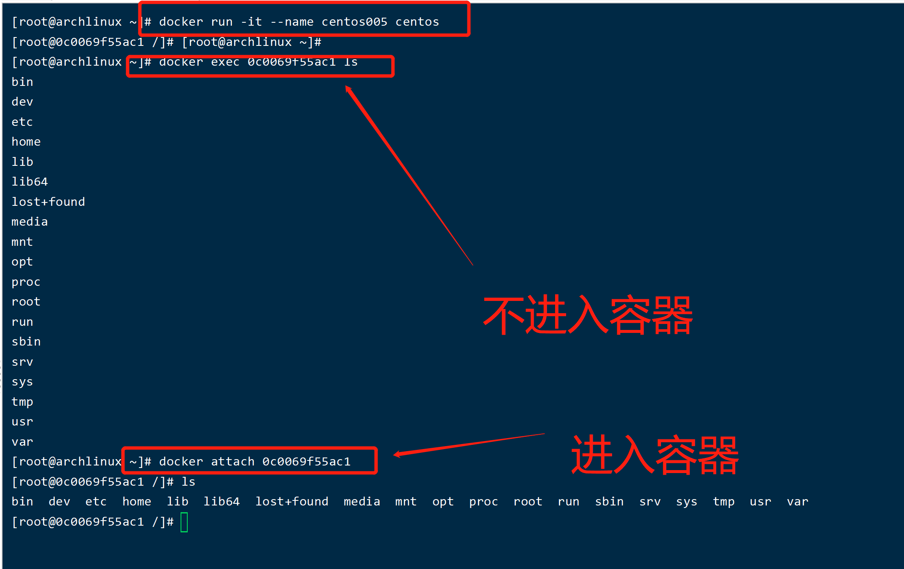
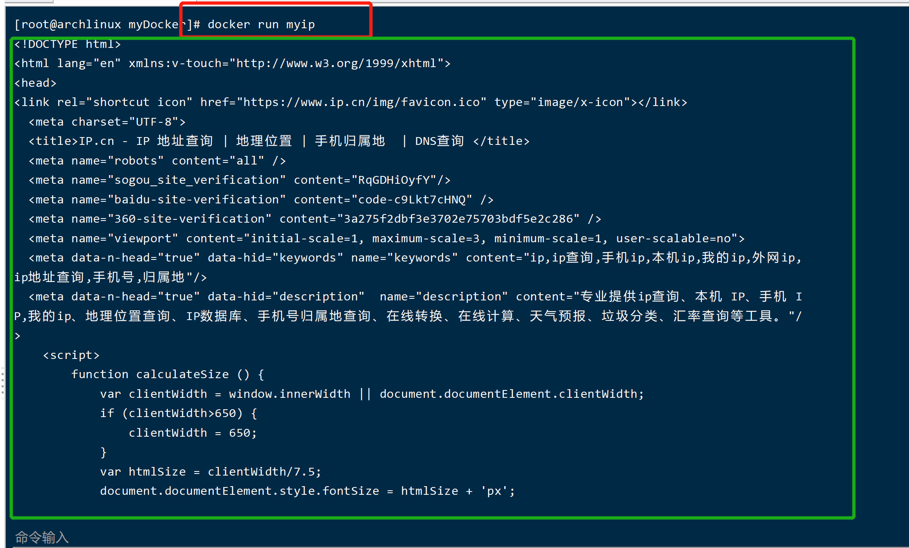

# 安装docker
以arch linux 为列子
### 下载docker
```
pacman -S docker
```

### 启动docker
```
systemctl start docker
```

### 开机启动docker
```
systemctl enabel docker
```

### 查看docker的运行状态
```
systemctl status docker
```
# docker的镜像命令
## docker images 命令
罗列出本地有的镜像

常见选项
* -a 列出本地所有的镜像（含中间镜像）
* -p 只显示镜像id
* --digests  只显示镜像的摘要信息
* --no-trunc 显示完整的镜像信息


## docker search 
```
docker search -s 100 --no-trunc hello-world 
```
在dockerhub搜索某个镜像
常用的option
* -s num 搜索某个镜像下大于num 星星(satrs)数的镜像
* --no-trunc 显示完整的描述


## docker pull
```
docker pull hello-world
```
相当于
```
docker pull hello-world:latest
```
不指定版本，就是最新版

## docker rmi 
删除某个镜像
```
docker rmi hello-world
```

由于hello-world镜像是在运行，需要加` -f `参数，把镜像强制删除

删除多个镜像
```
docker rmi -f nginx hello-world
```
删除全部的镜像
```
docker rmi -f $(docker images -qa)
```
查找到当前本地下所有的镜像id，然后将查询到的id传到rmi命令


# docker的容器命令
## docker run
* --name="容器新名称": 为容器指定一个新的名称，不指定改参数，则会随机生成一个
* -d 后台运行容器，并返回容器id。也即启动守护式容器
* -i 以`交互模式`运行容器，通常与-t同时使用；
* -t 为容器重新分配一个伪输入终端(Terminal)，通常与-i同时使用
* -P 随机端口号映射；
* -p 指定端口号映射，有以下四种格式
    * ip:hostPort:containerPort
    * ip::containerPort
    * hostPort:containerPort
    * containerPort
## 镜像生成容器
```
docker run -it --name containerName centos
```
以交互的方法打开centos，并返回伪终端，给容器起了名字，叫containerName

### 退出且关闭容器
```
[root@7841ced6dfd6 /]# exit
```

### 退出不关闭容器
使用快捷键 Ctrl + p + q

### 重新启动容器
```
docker restart 容器名称和容器Id
```

### 停止容器
```
docker stop 容器名称或者容器id
```

### 强制停止容器
```
docker kill 容器名称容器id
```
### 删除容器
```
docker rm 容器名称或者容器id
```
同时删除多个rm 命令后面跟上多个容器id

### 删除全部的容器
方法一：将docker查询到的容器id，传给rm命令
```
docker rm -f $(docker ps -qa)
```
方法二：将docker查询到的容器id，通过管道，传给rm命令
```
docker ps -aq | xargs docker rm
```

## docker ps 
查看docker下所有在运行的容器
```
docker ps
```
常用的参数有
* -a 查看所有运行过、正在运行的容器
* -l 查看上一次运行的容器
* -n 查看前面第几个运行过的实例
* -q 查看容器id

## docker log
查看某个容器中的日子
```
docker log 容器id
```
常用参数
* -t 加入时间戳
* -f 跟随最新的日子打印
* --tail num 显示最后num条

## docer top
查看容器内的 进程
```
docker top 容器id
```

## docker inspect 
查看容器的细节
```
docker inspect 容器id
```

## docker attach
之前进入到容器，按快捷键以Ctrl + p + q, 的方式出来，
```
docker attach 容器id
```
进入到doker中

## docker exec 容器id
```
docker exec 容器id
```
当前命令提示符在宿主机，即将要exec执行的容器，执行完之后，命令提示符仍然在宿主机上


也可以通过 路径进去到docker的容器

```
docker exec -t 镜像id /bin/bash
```


## docker cp
将容器中某些文件拷贝出来
```
docker cp 容器id:/user/a.text
```


## docker commit
将修改过后的容器，重新提交，变成新的容器
```
docker commit -a="authName" -m="commit msg" imageId imageName:tags
```
* -a 作者名称
* -m 提交的消息

# 数据卷
主机和容器之间的数据共享
docker run -v /主机目录下的路径:/容器目录下的路径 镜像名
```
docker run -it -v /hostDataVolumes:/containerDataVolumes centos
```
创建只读的数据卷在容器上
```
docker run -it -v /hostDataVolumes:/containerDataVolumes:ro centos
```

# dockerFile
是用来构建Docker镜像的构建文件，是由一系列命令和参数构成的脚步

dockerfile基础知识：
1. 每条保留字指令都必须为大写字母且后面要跟随至少一个参数
2. 指令按照从上到下，顺序执行
3. #好为注释
4. 每条指令都会创建一个新的镜像层，并对镜像进行提交

docker执行dockerfile的大致流程
1. docker从基础镜像运行一个容器
2. 执行一条指令并对容器作出修改
3. 执行类似docker commit 的操作提交一个新的镜像层
4. docker再基于刚提交的镜像运行一个新的容器
5. 执行dockerfile中的下一条指令直到所有指令都执行完成

dockerfile体系结构(保留字指令)
* FROM  基础镜像，当前编写的镜像是基于哪个镜像的
* MAINTAINER   描述性字段。镜像维护者的姓名和邮箱地址
* RUN   容器构建时需要的命令
* EXPOSE   当前容器对我暴露出的端口
* WORKDIR   指定在创建后，终端默认的进来工作目录，一个落脚点
* ENV   用来在构建镜像过程中设置环境变量
* ADD   将宿主机目录下的文件拷贝进镜像且ADD命令会自动去处理URL和解压tar压缩包
* COPY  
    * 类似ADD，拷贝文件和目录到镜像中。
    * 将从构建上下文目录中<源路径>的文件/目录复制到新的一层镜像内的<目标路径>位置
        * `COPY src dist`
        * `COPY ["src", "dist"]`
* VOLUME    容器数据卷，用于保存和持久化工作
* CMD
    * 指定一个容器启动时要运行的指令
    * dockerfile中可以有多个CMD命令，但是只会有最后一个生效，CMD会被docker run 最后跟的指令覆盖掉
* ENTRYPOINT
    * 指定一个容器启动时要运行的指令
    * ENTRYPOINT的目的和CMD一样，都是在指定容器启动程序及参数
* ONBUILD   当构建一个被继承的dockerfile时运行命令，父镜像在被子继承后父镜像的onbuild被触发

---

### 对centos再次封装
学习知识点
* ENV 可以定义变量
* WORKDIR 理解登录落脚点，docker run -it 进入容器的时候的路径，CMD 执行所在的目录
* RUN 运行某个命令
* 多个CMD只执行最后一个
```
FROM centos
MAINTAINER label<qinqihan163@163.com>
ENV MYPATH /usr/local
WORKDIR $MYPATH
RUN yum -y install vim
RUN yum -y install net-tools

EXPOSE 80 # 暴露的端口

CMD echo $MYPATH
CMD echo "success--------------------ok"
CMD /bin/bash
```

## CMD 和 ENTRYPOINT的区别案例
```bash
FROM centos
RUN yum -y install curl
CMD ["curl", "-s", "http://ip.cn"]
```
构建docker镜像
```bash
docker build -f /mydocker/dockerfile2 -t myip .
```
运行镜像, 会打印出HTML结果

当需求改成又要同时打印请求头的时候，需求在后面添加参数 -i

出现报错，其原因是因为，在dockerfile后面添加了一个命令, -i，CMD之后生效最后一个命令
```
FROM centos
RUN yum -y install curl
CMD curl -s https://www.ip.cn/
CMD -i
```

借用`ENTRYPOINT`重写命令
```
FROM centos
RUN yum -y install curl
ENTRYPOINT curl -s https://www.ip.cn/
```


`ENTRYPOINT`不会覆盖原来的命令，只会追加在里面

## docker build
将dockerFile构建成镜像

```
docker build -f /path/to/dockerfile/ -t newContainerName .
```

**注意后面有一个`.`,表示当前执行build的上下文**

## docker commit

提交成一个新的镜像(裹多一层千层饼)

 *  -a, --author string    Author (e.g., "John Hannibal Smith <hannibal@a-team.* com>") 作者
 *  -c, --change list      Apply Dockerfile instruction to the created image 
 *  -m, --message string   Commit message 提交信息
 *  -p, --pause            Pause container during commit (default true)


