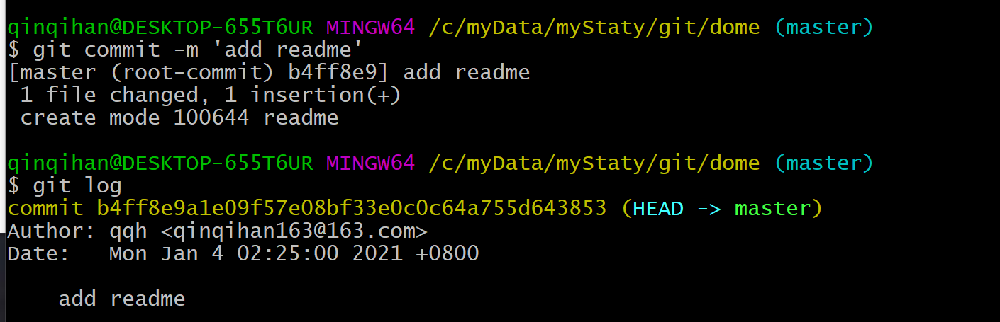

# git 极客时间

> git 的最小配置

```bash
git config --global user.name 'your name'
git config --global user.email 'your email'
```


* 查看全局的配置

```bash
git config --global --list
```


* 既然有全局`--global`的配置,也有其他项的配置

```bash
# 只在某个仓库中能设置，当前仓库生效
git config --local
# 当前用户生效，所有仓库都可以共享这个配置的参数
git config --global
# 操作系统中，所有用户和所有仓库都会引用到这里面的配置
git config --system
```
* 查看`--local`的配置


* 查看`--system`的配置


> git config local 的配置权重


* 查看全局的`--global --list`,然后配置`--local`


* 提交commit，并查看提交者的信息是什么



* 结论：`--local` 的权重比 `--global` 的大


 

