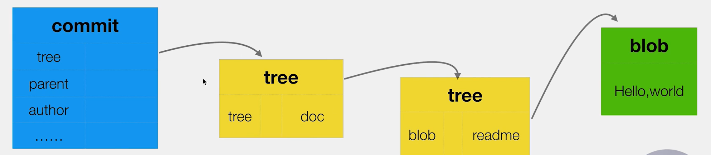

# commit之后会产生多少个树

```bash
/c/myData/myStaty/git_dome_store (master)
$ mkdir countTree

/c/myData/myStaty/git_dome_store (master)
$ cd countTree/

/c/myData/myStaty/git_dome_store/countTree (master)
$ ls -l
total 0

/c/myData/myStaty/git_dome_store/countTree (master)
$ git init # 初始化git仓库
Initialized empty Git repository in C:/myData/myStaty/git_dome_store/countTree/.git/

/c/myData/myStaty/git_dome_store/countTree (master)
$ mkdir doc

/c/myData/myStaty/git_dome_store/countTree (master)
$ git status
On branch master

No commits yet # 文件夹里面没有内容，不会被git管理

nothing to commit (create/copy files and use "git add" to track)

/c/myData/myStaty/git_dome_store/countTree (master)
$ cd doc/

/c/myData/myStaty/git_dome_store/countTree/doc (master)
$ echo 'hello word!' > readme # 生成一个新的readme文件

/c/myData/myStaty/git_dome_store/countTree/doc (master)
$ ls
readme

/c/myData/myStaty/git_dome_store/countTree/doc (master)
$ cd ..

/c/myData/myStaty/git_dome_store/countTree (master)
$ ls
doc/

/c/myData/myStaty/git_dome_store/countTree (master)
$ git status
On branch master

No commits yet

Untracked files:
  (use "git add <file>..." to include in what will be committed)
        doc/ # 有文件的文件夹，就会被git管理

nothing added to commit but untracked files present (use "git add" to track)

/c/myData/myStaty/git_dome_store/countTree (master)
$ find .git/objects -type f # 没有git add，不会产生文件

/c/myData/myStaty/git_dome_store/countTree (master)
$ git add doc/
warning: LF will be replaced by CRLF in doc/readme.
The file will have its original line endings in your working directory

/c/myData/myStaty/git_dome_store/countTree (master)
$ git status
On branch master

No commits yet

Changes to be committed:
  (use "git rm --cached <file>..." to unstage)
        new file:   doc/readme

/c/myData/myStaty/git_dome_store/countTree (master)
$ find .git/objects -type f
.git/objects/ec/71f80a98b96b172ff381d3b6bdbcc293c239f0

/c/myData/myStaty/git_dome_store/countTree (master)
$ git cat-file -t ec71f80a98b96b172ff # 检查git add产生的那个文件类型
blob

/c/myData/myStaty/git_dome_store/countTree (master)
$ git cat-file -p ec71f80a98b96b172ff # 检查git add产生的那个文件内容
hello word!

/c/myData/myStaty/git_dome_store/countTree (master)
$ git commit -m 'add readme'
[master (root-commit) 912cab1] add readme
 1 file changed, 1 insertion(+)
 create mode 100644 doc/readme

/c/myData/myStaty/git_dome_store/countTree (master)
$ find .git/objects -type f
.git/objects/87/fe51aace24798037aefcb873ea3ed9e1a40e68 # tree -> readme
.git/objects/91/2cab1109443247991086cfa654aed7a9b39d96 # commit
.git/objects/c0/c84160c9d6b40ba2663258c4d208ea8d7aeef8 # tree -> doc/
.git/objects/ec/71f80a98b96b172ff381d3b6bdbcc293c239f0 # blob === readme

/c/myData/myStaty/git_dome_store/countTree (master)
$ git cat-file -t 87fe51aace24798037ae
tree

/c/myData/myStaty/git_dome_store/countTree (master)
$ git cat-file -p 87fe51aace24798037ae
100644 blob ec71f80a98b96b172ff381d3b6bdbcc293c239f0    readme

/c/myData/myStaty/git_dome_store/countTree (master)
$ git cat-file -t 912cab
commit

/c/myData/myStaty/git_dome_store/countTree (master)
$ git cat-file -p 912cab
tree c0c84160c9d6b40ba2663258c4d208ea8d7aeef8
author 覃淇韩 <347343944@qq.com> 1619852262 +0800
committer 覃淇韩 <347343944@qq.com> 1619852262 +0800

add readme

/c/myData/myStaty/git_dome_store/countTree (master)
$ git cat-file -t c0c8
tree

/c/myData/myStaty/git_dome_store/countTree (master)
$ git cat-file -p c0c8
040000 tree 87fe51aace24798037aefcb873ea3ed9e1a40e68    doc

/c/myData/myStaty/git_dome_store/countTree (master)
$ git cat-file -t ec71f80a
blob

/c/myData/myStaty/git_dome_store/countTree (master)
$ git cat-file -p ec71f80a
hello word!
```




