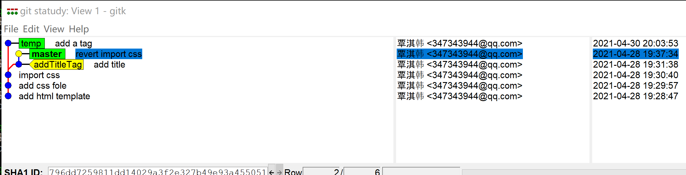

# 分离头指针
* 作用
    1. 当前HEAD指针不指向某个分支
    2. 当前产生的代码，不会与任何分支挂钩。
    3. 当再次切换分支，不提前当前代码为新新分支，将在后面不久被git清理掉
    4. .git/HEAD文件的内容为一个commit

* 产生分离头指针的方式一

```bash
/c/myData/myStaty/git_dome_store/git statudy (master)
$ git log -n3
commit 796dd7259811dd14029a3f2e327b49e93a455051 (HEAD -> master)
Author: 覃淇韩 <347343944@qq.com>
Date:   Wed Apr 28 19:37:34 2021 +0800

    revert import css

commit 45de11f1b55c746a46fb2aef180ae5f2da12eacd (tag: addTitleTag)
Author: 覃淇韩 <347343944@qq.com>
Date:   Wed Apr 28 19:31:38 2021 +0800

    add title

commit c24acaf743b7428396ed3702aa71a8a949ff0290
Author: 覃淇韩 <347343944@qq.com>
Date:   Wed Apr 28 19:30:40 2021 +0800

    import css

/c/myData/myStaty/git_dome_store/git statudy (master)
$ git checkout c24acaf743b7428396ed3702a
Note: switching to 'c24acaf743b7428396ed3702a'.

You are in 'detached HEAD' state. You can look around, make experimental
changes and commit them, and you can discard any commits you make in this
state without impacting any branches by switching back to a branch.

If you want to create a new branch to retain commits you create, you may
do so (now or later) by using -c with the switch command. Example:

  git switch -c <new-branch-name>

Or undo this operation with:

  git switch -

Turn off this advice by setting config variable advice.detachedHead to false

HEAD is now at c24acaf import css
```

* 在分离头指针尝试着去修改一些文件，并查看状态

```bash
/c/myData/myStaty/git_dome_store/git statudy ((c24acaf...)) # 当前HEAD没有指向任何分支
$ git status
HEAD detached at c24acaf # 提示当前是在分离头指针状态
Changes not staged for commit:
  (use "git add <file>..." to update what will be committed)
  (use "git restore <file>..." to discard changes in working directory)
        modified:   css.css

no changes added to commit (use "git add" and/or "git commit -a")
/c/myData/myStaty/git_dome_store/git statudy ((c24acaf...)) # 当前HEAD没有指向任何分支
$ git add -u # 添加代码到暂存区

/c/myData/myStaty/git_dome_store/git statudy ((c24acaf...))
$ git commit -m 'modify h1 tag color to deeppink' # 提交代码
[detached HEAD 0ae7225] modify h1 tag color to deeppink
 1 file changed, 3 insertions(+)

/c/myData/myStaty/git_dome_store/git statudy ((0ae7225...)) # 当前HEAD没有指向任何分支
$ git checkout master # 切换分支
Warning: you are leaving 1 commit behind, not connected to
any of your branches:

  0ae7225 modify h1 tag color to deeppink

If you want to keep it by creating a new branch, this may be a good time
to do so with:

 git branch <new-branch-name> 0ae7225 # 建议执行当前指令，保存成为新分支

Switched to branch 'master' # 当前是成功切换到master的
```

* 在gitk查看当前提交是否存在
    * 结果是并没有将之前在分离头指针的提交正式存起来



* 将分离头指针的提交在新建分支上
    * 分离头指针的东西将被永久保存

```bash
/c/myData/myStaty/git_dome_store/git statudy (master)
$ git branch fix_css 0ae7225
```


