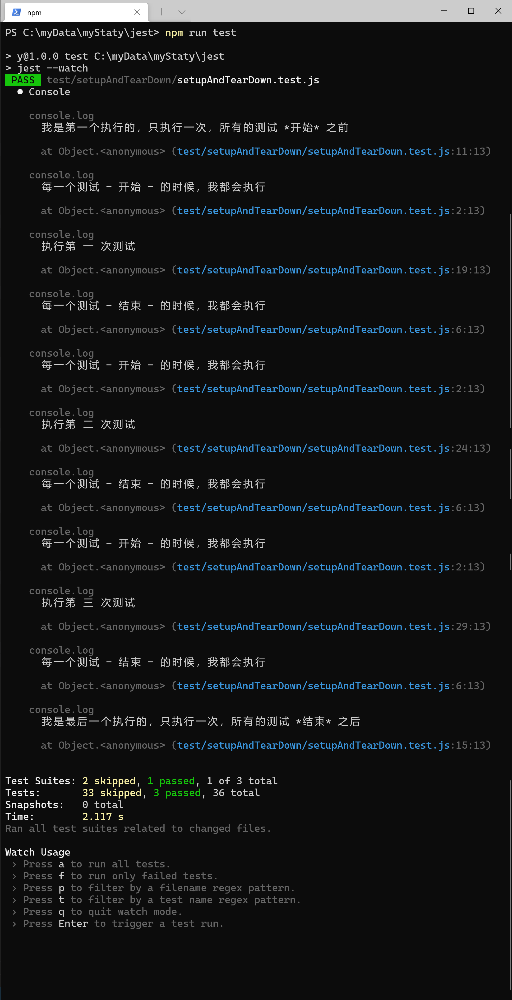
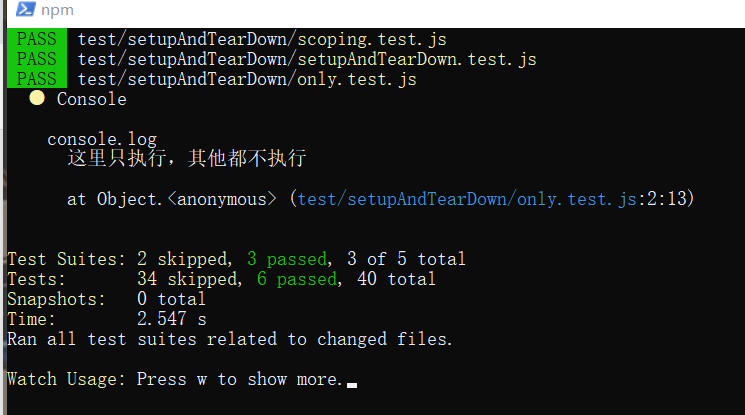
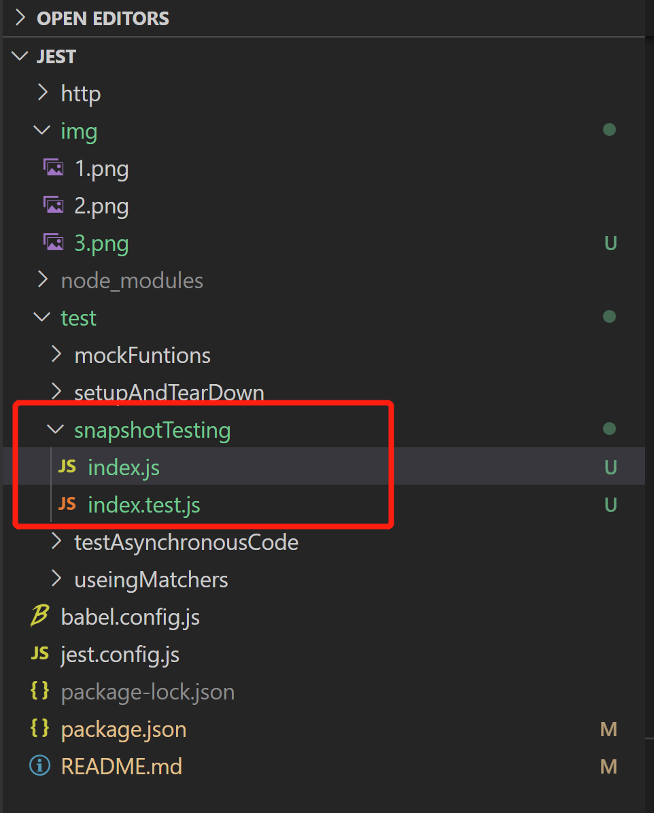
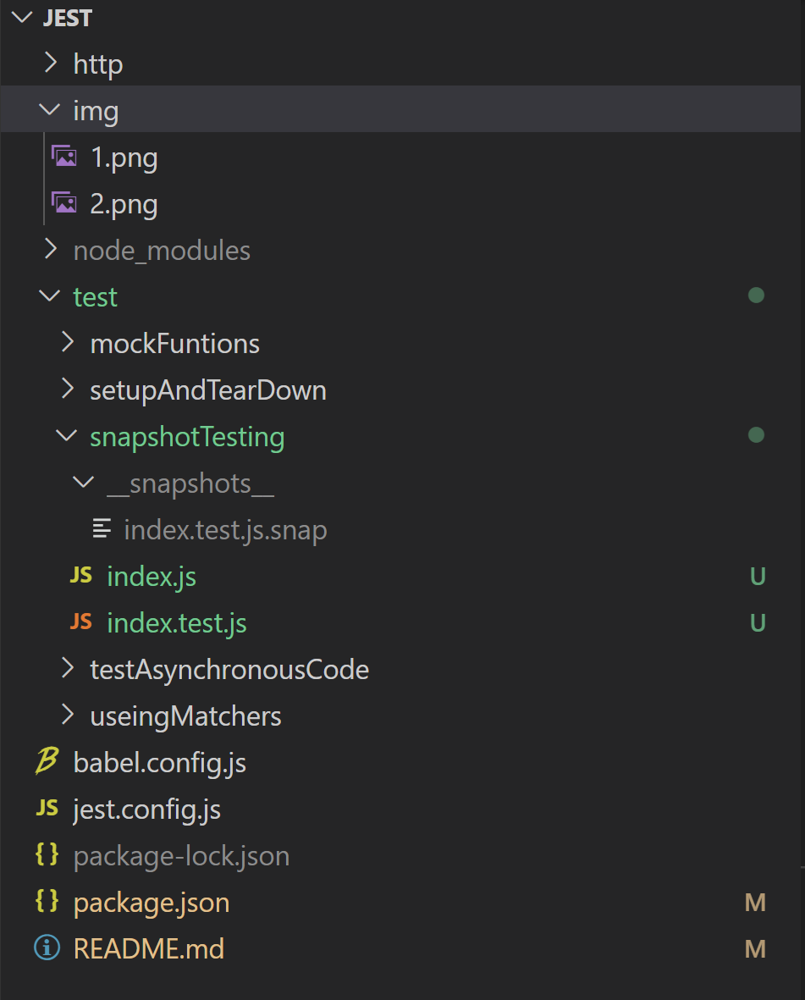
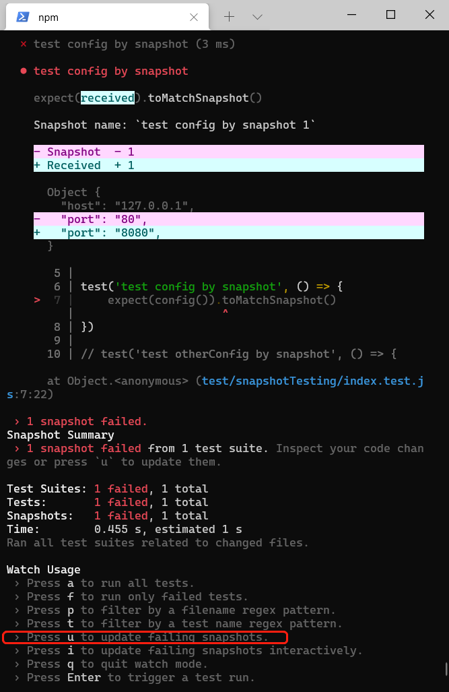

# 匹配器 matcher

## 匹配 null

```js
const isNull = () => null
test('测试返回值是否为null', () => {
    expect(isNull()).toBeNull()
})
```

## 匹配 undefine

```js
const isUndefine = () => {
    const obj = {name: 'qqh'}
    return obj['age']
}
test('测试返回值是否为undefined', () => {
    expect(isUndefine()).toBeUndefined()
})
```

## 匹配 true

```js
const isTrue = () => true
test('测试返回值是否为null', () => {
    expect(isTrue()).toTruthy()
})
```

## 匹配 false

```js
const isFalse = () => false
test('测试返回值是否为null', () => {
    expect(isFalse()).toBeFalsy()
})
```


# 生命周期

* 生命周期，处理异步请求的方式和```test()```的方法一样

```js
beforeEach(() => {
    console.log('每一个测试 - 开始 - 的时候，我都会执行')
})

afterEach(() => {
    console.log('每一个测试 - 结束 - 的时候，我都会执行')
})


beforeAll(() => {
    console.log('我是第一个执行的，只执行一次，所有的测试 *开始* 之前')
})

afterAll(() => {
    console.log('我是最后一个执行的，只执行一次，所有的测试 *结束* 之后')
})

test('第 一 次', () => {
    console.log('执行第 一 次测试')
    expect(1).toBe(1)
})

test('第 二 次', () => {
    console.log('执行第 二 次测试')
    expect(2).toBe(2)
})

test('第 三 次', () => {
    console.log('执行第 三 次测试')
    expect(3).toBe(3)
})
```
* 执行结果



## test.only

* 同一个文件内的测试用例，只执行当前这个，其他都不执行

应用场景，当你的测试用例很多都是错的，你可以单独对每一进行排查
```js
test.only('这里只执行，其他都不执行', () => {
    console.log('这里只执行，其他都不执行')
    expect(0).toBe(0)
})


test('这里不执行', () => {
    console.log('下面的不会执行，即使是错的测试用例')
    expect(1).toBe(2)
})
```

* 测试结果




# Mock function


## 定制的匹配器

```js
// 这个mock 函数至少被调用一次
expect(mockFunc).toHaveBeenCalled();

// mock 函数只是被调用一次，且参数为两个，参数为：arg1, arg2
expect(mockFunc).toHaveBeenCalledWith(arg1, arg2);

// mock 函数最后一次call 的时候，参数有两个，为：arg1, arg2
expect(mockFunc).toHaveBeenLastCalledWith(arg1, arg2);

// All calls and the name of the mock is written as a snapshot
expect(mockFunc).toMatchSnapshot();
```

## mock函数被调用的情况(mock函数匹配器的另外一种写法)

```js
// mock函数一定被调用过
expect(mockFunc.mock.calls.length).toBeGreaterThan(0);

// 调用函数的数组里面，至少有一次是包含arg1, arg2这两个参数的
expect(mockFunc.mock.calls).toContainEqual([arg1, arg2]);

// 最后一次调用的时候，有两个参数，参数为：arg1, arg2
expect(mockFunc.mock.calls[mockFunc.mock.calls.length - 1]).toEqual([
  arg1,
  arg2,
]);

// 最后一次调用，且传给mock函数里面的第一个参数是42
// (note that there is no sugar helper for this specific of an assertion)
expect(mockFunc.mock.calls[mockFunc.mock.calls.length - 1][0]).toBe(42);

// A snapshot will check that a mock was invoked the same number of times,
// in the same order, with the same arguments. It will also assert on the name.
expect(mockFunc.mock.calls).toEqual([[arg1, arg2]]);
expect(mockFunc.getMockName()).toBe('a mock name');
```


# 快照测试 snapshot test

* 原理：有快照匹配器的时候，会按照生成的第一次生成的结果去创建快照文件，第二次执行的时候，运行的时候，和快照里面的内容对比，如果不变(或者符合特定逻辑)，测试通过，如果和存在快照里面的不同，测试就不通过

```js
// index.js
export const config = () => {
    return {
        host: '127.0.0.1',
        port: '80'
    }
}
```

* 没有运行快照之前的目录



* 执行下面的代码，测试快照

```js
// index.test.js
import {
    config
} from './index';

test('test config by snapshot', () => {
    // 第一次执行，生成快照，第二次执行，测试结果和快照对比
    expect(config()).toMatchSnapshot()
})
```

* 运行快照之后的目录,生成了



* ```__snapshots__\index.test.js.snap```文件

```
// Jest Snapshot v1, https://goo.gl/fbAQLP

exports[`test config by snapshot 1`] = `
Object {
  "host": "127.0.0.1",
  "port": "80",
}
`;
```

* 尝试修改一个文件

看到前后修改的内容对比，如果确认当前的修改，按`u`，覆盖快照



* 重新生成，会覆盖快照

```
// Jest Snapshot v1, https://goo.gl/fbAQLP

exports[`test config by snapshot 1`] = `
Object {
  "host": "127.0.0.1",
  "port": "8080",
}
`;
```


