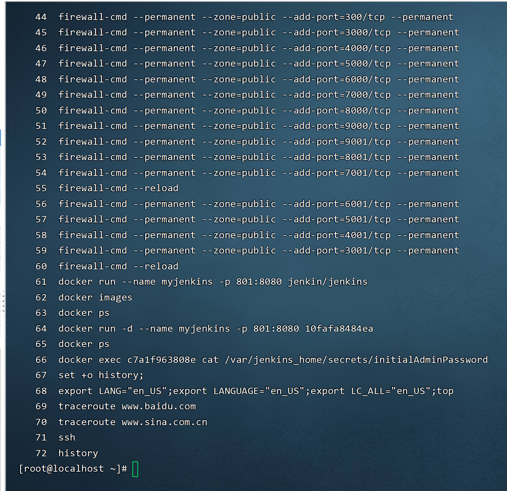
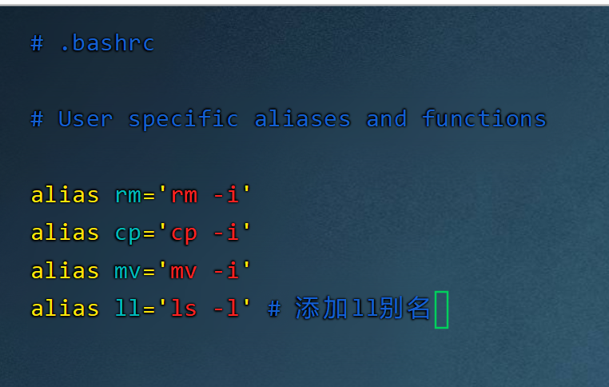

# history

1. 查看输入过的历史命令
2. `↑`和`↓`的方向键就是history命令的实现

```bash
[root@localhost ~]# history
```

 

* 所有用过的命令，保存在`~/.bash_history`下面
* history -w 
    * `history -w`运行之前，所有的命令保存在内存，等用户退出了，才把用过的命令，保存到`~/.bash_history`下面
    * `history -w`运行之后，每一次命令执行之后，就把命令保存到`~/.bash_history`下面
* history -c 
    * 删除之前所有的命令的历史记录


```bash
[root@localhost ~]# history -c 
[root@localhost ~]# vi ~/.bash_history 
[root@localhost ~]# history
    1  vi ~/.bash_history 
    2  history
```


# tab键

* 命令，文件夹，文件的目录在很长的情况下，不记得，可以按tab补全
* 当输入某个命令前面几个字母的时候，按tab见会自动补全
* 当按一次没有补全，而且没有出现效果，就按第二次，会显示，当前命令有可以补全的名字

```bash
[root@localhost ~]# add  # 按一次没有自动补全
addgnupghome  addpart       addr2line     adduser    # 第二次出现可以使用的命令作为参考   
[root@localhost ~]# add
```

# 别名和快捷键

> 命令行

```bash
[root@localhost ~]# alias # 查看设置别名的有什么
alias cp='cp -i'
alias egrep='egrep --color=auto'
alias fgrep='fgrep --color=auto'
alias grep='grep --color=auto'
alias l.='ls -d .* --color=auto'
alias ll='ls -l --color=auto'
alias ls='ls --color=auto'
alias mv='mv -i'
alias perlll='eval `perl -Mlocal::lib`'
alias rm='rm -i'
alias which='alias | /usr/bin/which --tty-only --read-alias --show-dot --show-tilde'
[root@localhost ~]# alias vi=vim   # 设置别名，将vim用vi代替
[root@localhost ~]# alias # 查看别名是否也生效
alias cp='cp -i'
alias egrep='egrep --color=auto'
alias fgrep='fgrep --color=auto'
alias grep='grep --color=auto'
alias l.='ls -d .* --color=auto'
alias ll='ls -l --color=auto'
alias ls='ls --color=auto'
alias mv='mv -i'
alias perlll='eval `perl -Mlocal::lib`'
alias rm='rm -i'
alias vi='vim' # 已生效
alias which='alias | /usr/bin/which --tty-only --read-alias --show-dot --show-tilde'
```

>> 执行命令的优先级

1. 执行用绝对路径或相对路径执行的命令
2. 别名
3. bash内部的命令
3. $PATH环境变量定义的目录查找顺序找到的第一命令


> 在**文件**中定义永久的别名

* 如果是root用户，就是在`/root/.bashrc`文件下添加记录
* 如果是普通用户，如user1，则在`/home/user1/.bashrc`文件下添加记录

```bash
[root@localhost ~]# vi /root/.bashrc
```



```bash
[root@localhost ~]# source /root/.bashrc  # 让刚刚添加的别名生效
[root@localhost ~]# cd /root/ 
[root@localhost ~]# ll # 执行别名
总用量 8
-rw-------. 1 root root 2336 3月  20 12:03 anaconda-ks.cfg
-rw-r--r--. 1 root root 2367 3月  20 05:33 initial-setup-ks.cfg
drwxr-xr-x. 2 root root    6 3月  20 06:28 perl5
[root@localhost ~]# ls -l # 和原生别名对比
总用量 8
-rw-------. 1 root root 2336 3月  20 12:03 anaconda-ks.cfg
-rw-r--r--. 1 root root 2367 3月  20 05:33 initial-setup-ks.cfg
drwxr-xr-x. 2 root root    6 3月  20 06:28 perl5
```

> 常用快捷键

* ctrl+A
    * 移动光标到命令开头
* ctrl+E
    * 把光标移动到命令行结尾
* ctrl+C
    * 总之当前命令
* ctrl+L
    * 清屏
* ctrl+U
    * 删除或者剪切光标之**前**的命令
* ctrl+K
    * 删除或者剪切光标之**后**的命令
* ctrl+Y
    * ctrl+U或者ctrl+K剪切的内容
* ctrl+R
    * 在历史命令中搜索关键字，来搜索之前输入的命令
* ctrl+D
    * 退出当前终端
* ctrl+Z
    * 暂停，放入后台
* ctrl+S
    * 暂停屏幕输出
* ctrl+Q
    * 恢复屏幕输出


