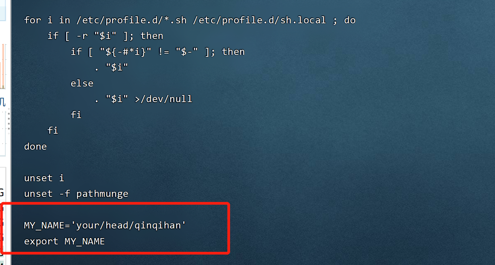

# shell 脚本编程

## 变量

> 系统变量
* $PATH
* $USER
* $PWD
* $SHELL

```bash
[root@localhost ~]# echo $USER
root
[root@localhost ~]# echo $PATH
/usr/local/sbin:/usr/local/bin:/usr/sbin:/usr/bin:/root/bin
[root@localhost ~]# echo $PWD
/root
[root@localhost ~]# echo $SHELL
/bin/bash
```

* 获取当前系统时间 `date`

```bash
[root@localhost /]# date
2021年 03月 18日 星期四 21:15:21 CST
```

> 自定义变量

>> 基本语法

1. 自定义变量：变量=值
2. 撤销(销毁/回收)变量： unset 变量名
3. 声明静态变量: readonly 变量，注意unset

>> 练习

```bash
[root@localhost /]# name='qqh'
[root@localhost /]# echo $name
qqh
[root@localhost /]# unset name
[root@localhost /]# echo $?
0
[root@localhost /]# echo $name

[root@localhost /]# readonly only='好的'
[root@localhost /]# echo $only
好的
[root@localhost /]# unset $only
-bash: unset: `好的': 不是有效的标识符
[root@localhost /]# echo $only
好的
```

>> 将命令执行的结果赋值给变量
* 方式一

```
[root@localhost /]# A=`ls`
[root@localhost /]# echo $A
bin boot dev docker_project etc home html lib lib64 media mnt opt proc root run sbin srv static sys tmp tomcatDate usr var
[root@localhost /]# 
```

* 方式二

```bash
[root@localhost /]# cd /html/
[root@localhost html]# ls
build  jenkinsDome
[root@localhost html]# cd /
[root@localhost /]# B=$(ls /html/)
[root@localhost /]# echo $B
build jenkinsDome
```

>> 设置环境变量

* 基本语法

1. export 变量名=变量值
2. source 配置文件
3. echo $变量名

* 快速入门
1. 在/etc/profile文件中定义MY_NAME环境变量



2. 执行`source`刷新环境变量

```bash
[root@localhost /]# vi /etc/profile
[root@localhost /]# source /etc/profile
[root@localhost /]# echo $?
0
```

3. 输出`MY_NAME`环境变量

```bash
[root@localhost /]# echo $MY_NAME
your/head/qinqihan
```

