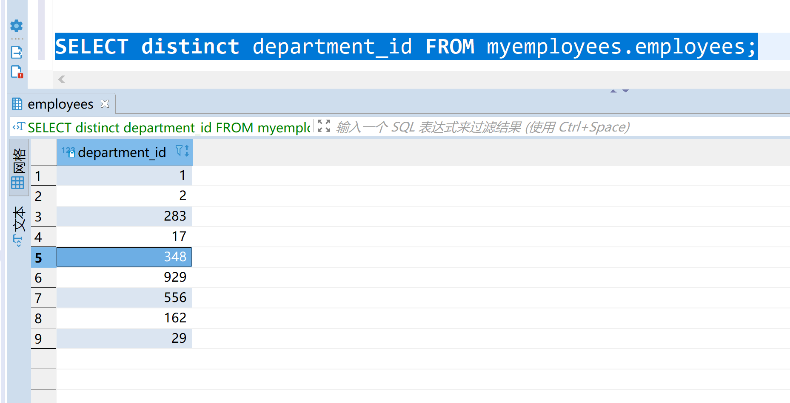
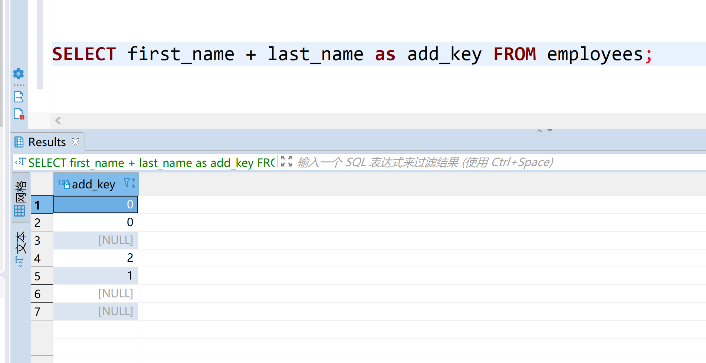

# 基础查询
语法：
select 字段名 from 表格名

特点：
1. 查询列表可以是，表中的字段，常量值，表达式，函数
2. 查询的结果是一个虚拟的表格

* 查询表格的单个字段
```sql
select first_name from myemployees;
```
* 查询多个字段
```sql
select first_name, last_name from myemployees;
```

* 查询所有的字段
```sql
select * from myemployees
```
弊端：安装表格的顺序查出来，并不能定制查询的字段顺序

# 查询常量
查询100
```sql
select 100;
```
查询字符串uncle
```sql
select 'uncle';
```
# 查询表达式
```sql
select 10 * 10;
```
查询到的是表达式的结果，可以加减乘除取余
# 查询函数
查看版本
```sql
select version;
```
查看当前在用的数据库
```sql
select database;
```

# 起别名
优点：
1. 便于理解
2. 如果要查询的字段有重名的情况，可以用别名分开
* 方式一：
```sql
SELECT 1 + 1 as 加法;
```


* 方式二
```sql
SELECT 1 + 1  加法;
```


* 方式三 
对于有空格分开的单词，要用双引号引起来
```sql
SELECT manger_id "good good" from departments;
```


## 去重
没有去重之前
```sql
SELECT department_id FROM myemployees.employees;
```


使用关键字`distinct`去重
```sql
SELECT distinct department_id FROM myemployees.employees;
```


# 拼接
尝试一个结果
```sql
SELECT first_name, last_name from employees;
```


做`first_name`和`last_name`的拼接
尝试用`+`拼接
```sql
SELECT first_name + last_name from employees;
```


解析：
以前我们知道，select可以做为运算，在其他语言中，可以做为拼接字符串，但是在sql语言中，符号`+`只能作为运算符表达式，
1. 尝试将字符串转成数值
2. 如果成功，则为对应的数值，最后执行运算
3. 如果不成功，则变成数值0，最后执行运算
4. 如果运算符的其中一侧为`null`，最后的运算结构肯定为`null`;

总结：`+`号只能作为运算符，不能拼接

用`concat()`的方法拼接
```sql
SELECT CONCAT(first_name, "-", last_name) as add_opersion from employees;
```


## IFNULL函数的使用
需求场景：
将first_name, last_name, job_id, commission_pct 拼接在一起，
并且取一个名字叫做'haode',还要用`-`隔开
正常逻辑代码：
```sql
SELECT CONCAT(first_name, '-', last_name, '-', job_id, '-', commission_pct) FROM employees;
```


原因分析：
`CONCAT`函数要合并的字段里面，有其中一个表格的字段为`null`，合并之后，最终的值是`null`

----

`IFNULL()`函数
```sql
select isnull(commission_pct, '?'), commission_pct from employees;
```


重新构造查询：
```sql
SELECT CONCAT(first_name, '-', last_name, '-', job_id, '-', ifnull(commission_pct, '?')) FROM employees;
```


## 条件查询
语法：
select 字段 from 表名 where 筛选条件
* 简单的条件运算符：>, <, = , !=, <>, >=, <=
* 逻辑运算符：
    * && ，|| ， !
    * and , or , not
* 模糊查询：
    * like
    * between and 
    * in 
    * is null
    * is not null

### 条件运算符的运用。
查询工资大于5000的员工信息
```sql
SELECT * FROM employees where salary > 5000;
```


查询部门编号不等于13的员工名和部门编号；
```sql
SELECT last_name, department_id FROM employees where department_id != 13;
```

```sql
SELECT last_name, department_id FROM employees where department_id <> 13;
```


### 逻辑运算的运用
查询工资在5000到10000，之间的员工名、工资及奖金
```sql
SELECT * from employees where department_id < 50 OR department_id > 100 or salary > 5000;
```


查询部门编号不是在90到110之间，或者工资高于10000的员工信息
方式一

```sql
SELECT * from employees where NOT (department_id > 50 AND department_id < 100) or salary > 5000;
```

方式二
 
```sql
SELECT * from employees where department_id < 50 OR department_id > 100 or salary > 5000;
```


## 模糊查询
* like 
    * % -> 一个或者多个任意字符
    * _ -> 一个任意字符
查询员工名中包含字符`a`的员工信息

```sql
SELECT * from employees WHERE last_name LIKE '%a%';
```


第三个字符是`h`的名字
```sql
select last_name from employees where last_name LIKE '__h%';
```


第四个字符是下划线`_`的名字

```sql
SELECT last_name from employees where last_name like '___\_%';
```


解析:用 `\`转义`_`为普通字符


ESCAPE关键字声明转义字符（官方推荐）
```sql
SELECT last_name from employees where last_name like '___$_%' ESCAPE '$';
```


### between and
查询员工编号在100 到120 之间的员工信息；

```sql
SELECT * from employees where employee_id BETWEEN 20 AND 30;
```
* 注意事项
    1. 包含起始和终止的值
    2. 必须是升序

## in 关键字

查找名字是`qin`, `ad`, `add`的用户信息
方式一：

```sql
SELECT * from employees where first_name = 'qin' or first_name = 'ad' or first_name = 'add';
```


方式二：

```js
SELECT * from employees where first_name in ('qin', 'ad', 'add');
```


## is null 的用法
查找没有奖金的员工信息
错误的做法
```sql
SELECT last_name FROM employees where commission_pct = null;
```


解析：因为`=`不能判断 `null`

```sql
SELECT * FROM employees where commission_pct is null;
```


## is not null 的用法
查找有奖金的员工信息
```sql
SELECT * FROM employees where commission_pct is not null;
```


## 安全等于 <=>
符号的意思是判断是否等于

查找没有奖金的员工信息
```sql
SELECT * FROM employees where commission_pct <=> null;
```


