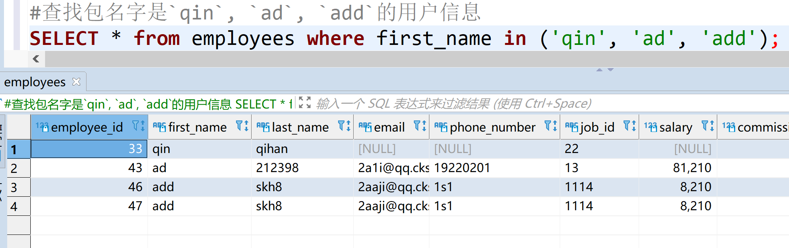
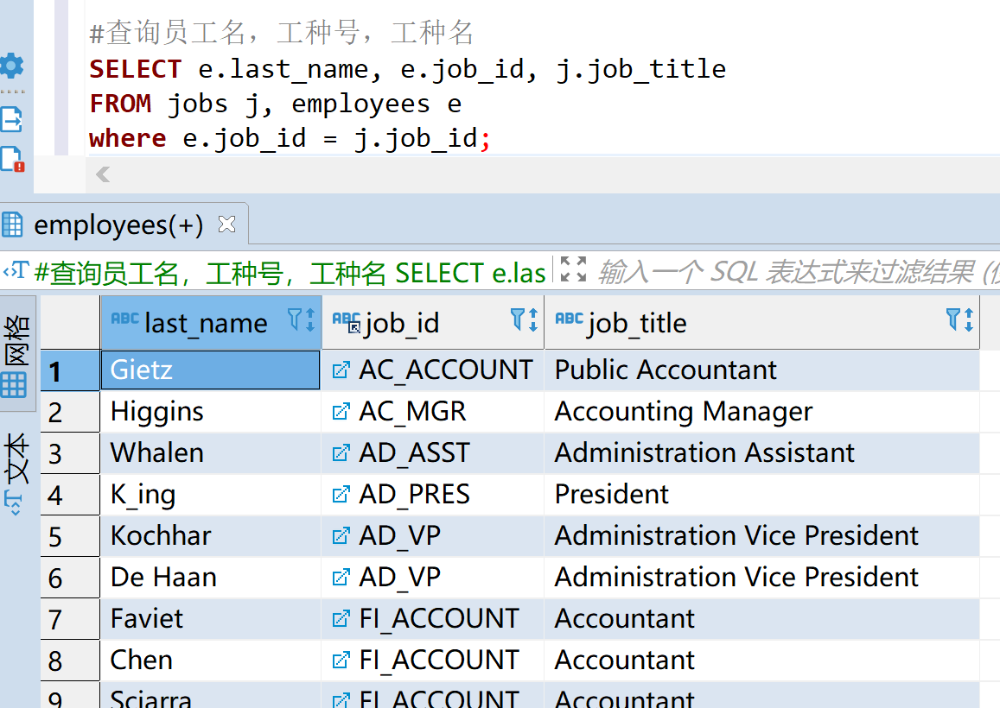

# 基础查询
语法：
select 字段名 from 表格名

特点：
1. 查询列表可以是，表中的字段，常量值，表达式，函数
2. 查询的结果是一个虚拟的表格

* 查询表格的单个字段
```sql
select first_name from myemployees;
```
* 查询多个字段
```sql
select first_name, last_name from myemployees;
```

* 查询所有的字段
```sql
select * from myemployees
```
弊端：安装表格的顺序查出来，并不能定制查询的字段顺序

# 查询常量
查询100
```sql
select 100;
```
查询字符串uncle
```sql
select 'uncle';
```
# 查询表达式
```sql
select 10 * 10;
```
查询到的是表达式的结果，可以加减乘除取余
# 查询函数
查看版本
```sql
select version;
```
查看当前在用的数据库
```sql
select database;
```

# 起别名
优点：
1. 便于理解
2. 如果要查询的字段有重名的情况，可以用别名分开
* 方式一：
```sql
SELECT 1 + 1 as 加法;
```


* 方式二
```sql
SELECT 1 + 1  加法;
```


* 方式三 
对于有空格分开的单词，要用双引号引起来
```sql
SELECT manger_id "good good" from departments;
```


## 去重
没有去重之前
```sql
SELECT department_id FROM myemployees.employees;
```


使用关键字`distinct`去重
```sql
SELECT distinct department_id FROM myemployees.employees;
```


# 拼接
尝试一个结果
```sql
SELECT first_name, last_name from employees;
```


做`first_name`和`last_name`的拼接
尝试用`+`拼接
```sql
SELECT first_name + last_name from employees;
```


解析：
以前我们知道，select可以做为运算，在其他语言中，可以做为拼接字符串，但是在sql语言中，符号`+`只能作为运算符表达式，
1. 尝试将字符串转成数值
2. 如果成功，则为对应的数值，最后执行运算
3. 如果不成功，则变成数值0，最后执行运算
4. 如果运算符的其中一侧为`null`，最后的运算结构肯定为`null`;

总结：`+`号只能作为运算符，不能拼接

用`concat()`的方法拼接
```sql
SELECT CONCAT(first_name, "-", last_name) as add_opersion from employees;
```


## IFNULL函数的使用
需求场景：
将first_name, last_name, job_id, commission_pct 拼接在一起，
并且取一个名字叫做'haode',还要用`-`隔开
正常逻辑代码：
```sql
SELECT CONCAT(first_name, '-', last_name, '-', job_id, '-', commission_pct) FROM employees;
```


原因分析：
`CONCAT`函数要合并的字段里面，有其中一个表格的字段为`null`，合并之后，最终的值是`null`

----

`IFNULL()`函数
```sql
select isnull(commission_pct, '?'), commission_pct from employees;
```


重新构造查询：
```sql
SELECT CONCAT(first_name, '-', last_name, '-', job_id, '-', ifnull(commission_pct, '?')) FROM employees;
```


## 条件查询
语法：
select 字段 from 表名 where 筛选条件
* 简单的条件运算符：>, <, = , !=, <>, >=, <=
* 逻辑运算符：
    * && ，|| ， !
    * and , or , not
* 模糊查询：
    * like
    * between and 
    * in 
    * is null
    * is not null

### 条件运算符的运用。
查询工资大于5000的员工信息
```sql
SELECT * FROM employees where salary > 5000;
```


查询部门编号不等于13的员工名和部门编号；
```sql
SELECT last_name, department_id FROM employees where department_id != 13;
```

```sql
SELECT last_name, department_id FROM employees where department_id <> 13;
```


### 逻辑运算的运用
查询工资在5000到10000，之间的员工名、工资及奖金
```sql
SELECT * from employees where department_id < 50 OR department_id > 100 or salary > 5000;
```


查询部门编号不是在90到110之间，或者工资高于10000的员工信息
方式一

```sql
SELECT * from employees where NOT (department_id > 50 AND department_id < 100) or salary > 5000;
```

方式二
 
```sql
SELECT * from employees where department_id < 50 OR department_id > 100 or salary > 5000;
```


## 模糊查询
* like 
    * % -> 一个或者多个任意字符
    * _ -> 一个任意字符
查询员工名中包含字符`a`的员工信息

```sql
SELECT * from employees WHERE last_name LIKE '%a%';
```


第三个字符是`h`的名字
```sql
select last_name from employees where last_name LIKE '__h%';
```


第四个字符是下划线`_`的名字

```sql
SELECT last_name from employees where last_name like '___\_%';
```


解析:用 `\`转义`_`为普通字符


ESCAPE关键字声明转义字符（官方推荐）
```sql
SELECT last_name from employees where last_name like '___$_%' ESCAPE '$';
```


### between and
查询员工编号在100 到120 之间的员工信息；

```sql
SELECT * from employees where employee_id BETWEEN 20 AND 30;
```
* 注意事项
    1. 包含起始和终止的值
    2. 必须是升序

## in 关键字

查找名字是`qin`, `ad`, `add`的用户信息
方式一：

```sql
SELECT * from employees where first_name = 'qin' or first_name = 'ad' or first_name = 'add';
```


方式二：

```js
SELECT * from employees where first_name in ('qin', 'ad', 'add');
```



## is null 的用法
查找没有奖金的员工信息
错误的做法
```sql
SELECT last_name FROM employees where commission_pct = null;
```


解析：因为`=`不能判断 `null`

```sql
SELECT * FROM employees where commission_pct is null;
```


## is not null 的用法
查找有奖金的员工信息
```sql
SELECT * FROM employees where commission_pct is not null;
```


## 安全等于 <=>
符号的意思是判断是否等于

查找没有奖金的员工信息
```sql
SELECT * FROM employees where commission_pct <=> null;
```


## 排序 order by
语法：

select 字段名
from 表名
[where 条件]
[order by asc | desc]

特点：
 * 1、asc 为升序(默认)，desc 为降序
 * 2、order by 子句中可以支持的排序的有：字段，表达式，别名，函数，多个字段
 * 3、order by 子句一般放在查询语句的后面，limit子句除外

--- 

* 单个字段查询
按工资降序排序查询员工信息

```sql
SELECT * FROM employees order by salary DESC ;
```


* 表达式查询 
按年薪降序排序查询员工姓名和年薪
```sql
SELECT last_name, salary * 12 *  IFNULL(commission_pct, 1) FROM employees  order by salary * 12 *  IFNULL(commission_pct, 1) desc;
```


* 别名查询 
按年薪降序排序查询员工姓名和年薪
```sql
SELECT last_name, salary * 12 *  IFNULL(commission_pct, 1) 年薪 FROM employees  order by 年薪 desc;
```


* 函数查询
按名字的长度降序，显示员工信息;
```sql
SELECT last_name, salary * 12 *  IFNULL(commission_pct, 1) 年薪 FROM employees  order by 年薪 desc;
```


* 多个字段同时查询
员工id升序，工资降序查询员工信息
```sql
SELECT * FROM  employees order by employee_id, salary DESC ;
```


---

# 常用函数
调用
```
select 函数名(实参)
```

分类
1. 单行函数
    * concat, length, ifnull等
2. 分组函数
    * 字符函数
    * 数学函数
    * 日期函数
    * 其他函数
    * 流程控制函数
## 字符函数
1. length
查询字符串的`字节`长度
```sql
select length('你好abcd');
```
output: 10

2. concat
合并多个字符成一个字符
查询员工的姓名，中间用`※`隔开，起别名为`姓名`
```sql
select concat()
```


3. lower/upper
lower 转小写
upper 转大写
```sql
select lower('ABC');
# output  =>  abc
```

```sql
select upper('efg')
# output =>  EFG
```

4. substr/substring
截取字符串。传入的函数参数不同，实现不同的函数重装

```sql
select substr('abcdef', 2);
# output => bcdef
# ps: 截取的字符串，起始下标是1
```

查询用户姓名。第一个姓的字母大写，其他字母小写，用`-`隔开
```sql
SELECT CONCAT(UPPER(SUBSTRING(first_name, 1, 1)), substring(first_name, 2) , '-', LOWER(last_name)) 姓名 from employees;
```


5. instr
查找某个字符串是否在某个给定的字符串中，并返回查找的字符串的开始下标;查不到返回0
```sql
select instr('abcdef', 'de');
# output => 4

select instr('abcdef', 'g');
# output => 0
```

6. trim
去掉前后空格、某个种格式的字符
```sql
select length(trim('    abc    '));
# output => 3

select trim('aa' from 'aaaaaaa好的aaaaa好的aaaa');
# output => 好的aaaaa好的
```

7. lpad
parameter：
第一个：目标字符串
第二个：到指定长度
第三个：要填充的字符串
给定字符串左边填充某个字符串，到给定长度。

```sql
select lpad('嗯', 12, "*");
# 嗯 字符串 前面填充 *  直到目标字符串长度为12
# output => ***********嗯
```
8. rpad
参数同上，当前函数在右边填充字符

```sql
select rpad('好', 5, '啊');
# output => 好啊啊啊啊
```

9. replace
替换，概念参考js的replace
```sql
select replace('abcdefgf', 'cdef', ' **** ');
# output => ab **** gf
```

## 数学函数
### round() 四舍五入
```sql
select round(1.5);
# output => 2
select round(-1.5);
# output => -2
select round(1.245, 2);
# output => 1.25
```
### ceil() 向上取整
```sql
select ceil(1.2);
# output => 2
select ceil(-2.3);
# output => -2
```

### floor() 向下取整
```sql
select floor(1.2);
# output => 1
select floor(-2.3);
# output => -3
```
### mod() 取余数
```sql
select mod(10, 3);
# output => 1
SELECT 10 % 3;
# output => 1
```

## 日期函数
### now 返回当前系统日期时间
```sql
select now();
# output => 2020-11-30 13:01:38
```

# 获取年，月，日，时，分，秒
```sql
select SELECT YEAR(now());
# output => 2020
SELECT YEAR(now()); # 2020
SELECT YEAR("1999-1-1 20:59:59"); # 1999
SELECT MONTH("1999-1-1 20:59:59"); # 1
SELECT MONTHNAME(NOW()); # November
SELECT DAYOFMONTH("1999-1-2 20:59:58");
SELECT DAY("1999-1-1 20:59:59"); # 1
```

# str_to_date

|符合|解析|
|---|------|
|%Y|四位的年|
|%y|2位的年份|
|%m|月份(01,02,...,11,12)|
|%c|月份(1,2,...,11,12)|
|%d|日(01,02,...)|
|%H|小时(24小时制)|
|%h|小时(12小时制)|
|%i|分钟(00,01,...,59)|
|%s|秒(00,01,...,59)|


```sql
SELECT str_to_date('1999-6-8', '%Y-%m-%d');
# 1999-06-08
```

### date_fromat() 将时间转成指定格式
```sql
select date_format('2022-01-26', '%c月/%Y年 --%d日');
# 1月/2022年 --26日
```

```sql
SELECT DATE_FORMAT(hireadate, '%m月/%d日 %y年') from employees;
```


---

## 其他函数

### version(), datebase(), user(); password(), md5()
查询当前mysql的版本号
```sql
select version();
# 8.0.22
```
查询当前 use database的数据
```sql
select database();
# myemployees
```

查询当前用户
```sql
select user();
# root@192.168.196.1
```

## 流程控制语句
### IF() 类似于js的 if eles 或者三元表达式
```sql
select if(10 > 9, '大', '小');
# 大
```
### case when then end
实现语法逻辑与js相同的功能
```js
var val = 2;
switch (val) {
    case 1 :
        console.log('我是1');
        break;
    case 2 :
        console.log('我是2');
        break;
    default:
        console.log('我不知道');
        break;
}
```
在mysql中实现js中`switch case`的逻辑;
```sql
select
case 2
when 1 then '我是1'
when 2 then '我是2'
else '我不知道你是谁'
end;
```
案例：
当部门是133的，工资减半
当部门是1203的，工资打7折
其他为9折
```sql
SELECT salary 原始工资, 
case salary
when 133 then salary * 0.5
when 1203 then salary * 0.7
else salary * 0.9
end 打折
from employees;
```
在js中 `if() else if ()`
```js
var a = 3
if(a < 2) {
    console.log('我小于2')
} else if (a < 3) {
    console.log('我小于3')
} else if (a < 4) {
    console.log('我小于4')
} else {
    console.log('我也不知道怎么算')
}
```
在mysql中实现
案例：
当工资大于20000 显示为高层
当工资大于10000 显示为中层
否则 老铁，你的工资没有毛病
```sql
select salary,
case 
when salary > 20000 then '高层'
when salary > 10000 then '中层'
else '老铁，你的工资没有毛病'
end 薪资划分
from employees;
```


## 分组函数
分组函数也叫聚合函数
函数有：sum(), max(), min(), avg(), count()
特点：
* sum, avg() 一般只处理数字型，min, max, count 可以任何类型
* 以上的分组忽略null的值
* 可以和`distinct`搭配实现去重的运算
* 和分组函数一同查询的字段要求是`group by`后的字段  

## 分组查询
语法
```txt
select 分组函数，列(要求出现在group by后面)
from 表名
[where 条件]
group by 分组的列表
[order by 列名]
```
*  案列：查询每个部门的平均工资

```sql
SELECT AVG(salary), department_id FROM employees
where department_id  is NOT NULL 
group by department_id;
```


* 案列：查询每个位置的部门个数
```sql
select count(*), location_id from departments group by location_id
```


### 在分组条件下，添加条件筛选
* 邮箱中包含a字符的，每个部门的平均工资
```sql
SELECT AVG(salary), department_id FROM employees
where email LIKE "%a%"
group by department_id;
```


* 查询哪个部门的员工个数 > 2

```sql 
SELECT COUNT(*), department_id FROM employees
group by department_id
HAVING count(*)>2;
```


* 查询每个工种有奖金的员工的最高工资 > 12000

```sql
SELECT MAX(salary), job_id FROM employees
where commission_pct IS NOT null
group by job_id HAVING MAX(salary) > 12000;
```


* 查询领导编号>102的每个领导手下的最低工资>5000的领导编号是哪个，以及其最低工资；

```sql
SELECT MIN(salary), manager_id FROM employees
where manager_id  > 102
GROUP BY manager_id
HAVING MIN(salary) > 5000;
```

### 分组查询的特点

|特点|数据源|位置|关键字|
|---|---|---|---|
|分组前筛选|原始表|group by的前面|where|
|分组后筛选|分组后的结果集|group by后面|having|

### 按表达式或函数分组

* 按员工姓名长度分组，查询每一组的员工的员工个数，筛选员工个数>5的有哪些

```sql
SELECT COUNT(*) c, LENGTH(CONCAT(last_name, first_name)) as len 
FROM employees
group by len
HAVING c > 5;
```


由上面的查询可以知道`group by`和`having` 都支持别名，
但是oracle不支持

* 查询每个部门每个工种的员工的平均工资

```sql
SELECT AVG(salary), department_id , job_id 
FROM employees
group by department_id, job_id;
```


* 查询每个部门查询每个部门每个工种的员工的平均工资，并且按平均工资的高低显示

```sql
SELECT AVG(salary), department_id , job_id 
FROM employees
group by department_id, job_id
ORDER by AVG(salary) DESC ;
```


# sql-92语法
## 连接查询
* 含义：又叫做连接查询，当查询的字段来自于多个表时，就会使用连接查询
* 笛卡尔积：表一有n行，表二有m行，结果=m*n
* 按功能分类：
    * 内连接
        * 等值连接
        * 非等值连接
        * 自连接
    * 外连接
        * 左连接
        * 右连接
        * 全连接
    * 交叉连接

## 等值连接

* 查询员工对应的部门名
```sql
SELECT last_name, department_name 
FROM employees, departments
where employees.department_id = departments.department_id;
```


### 为表起别名
* 查询员工名，工种号，工种名
```sql
SELECT e.last_name, e.job_id, j.job_title 
FROM jobs j, employees as e
where e.job_id = j.job_id;
```


由上面的查询语句可以知道
* 表名可以支持别名

### 连接查询，添加其他筛选条件
使用`AND`连接条件
* 查询有奖金的员工名、部门名
```sql
SELECT 
last_name , department_name
FROM employees e, departments d
where e.department_id = d.department_id 
AND e.commission_pct is NOT NULL;
```


* 查询城市名中第二个字符为o的部门名和城市名
```sql
SELECT
city, department_name
FROM 
locations l, departments d
where
l.location_id = d.location_id 
AND
l.city LIKE '_o%';
```


* 查询每个城市的部门个数
```sql
SELECT 
COUNT(*), city
FROM departments d, locations l
where d.location_id = l.location_id
GROUP BY l.city ;
```


* 查询有奖金的每个部门的部门名和部门的领导编号和该部门的最低工资

```sql
SELECT
d.department_name, e.department_id, d.manager_id ,MIN(e.salary)
FROM
departments d ,employees e
where
e.department_id = d.department_id
AND e.commission_pct IS NOT NULL
GROUP BY e.department_id;
```


* 查询有奖金的每个部门的部门名和部门的领导编号和该部门的最低工资

```sql
SELECT 
d.department_name , d.manager_id ,MIN(salary)
from departments d , employees e
where d.department_id = e.department_id
AND commission_pct IS NOT NULL
GROUP BY d.department_name , d.manager_id ;
```


* 查询每个工种的工种名称和员工个数，并且按员工个数排序

```sql
SELECT 
j.job_title, COUNT(*) 
FROM employees e , jobs j 
where j.job_id = e.job_id 
GROUP BY j.job_title
ORDER BY COUNT(*) DESC ;
```


* 查询员工名，部门名和所在的城市

```sql
SELECT 
	e.last_name ,d.department_name ,l.city 
FROM 
	employees e ,departments d ,locations l
where
	e.department_id = d.department_id 
AND 
	d.location_id = l.location_id ;
```


### 非等值连接

* 查询员工的姓名，工资，以及员工的工资级别

```sql
SELECT 
	last_name , salary, jg.grade_level
FROM 
	employees e ,job_grades jg
where 
	e.salary BETWEEN jg.lowest_sal AND jg.highest_sal;
```


### 自连接

* 需求：查找员工名和对应的领导名


* 由上图分析
    * 员工信息表中，查询pataballa的信息中，包含manager_id
    * 而manager_id又是对应员工表中的employee_id
    * 领导名，通过manager_id -> employee_id -> last_name

```sql
SELECT 
	e.last_name, e.employee_id, m.last_name , m.manager_id 
FROM 
	employees e , employees m
where
	e.employee_id = m.manager_id;
```


# sql-99语法

* 语法
select 查询的字段名
from 表名 别名 【连接类型】
join 表名 别名
on 连接条件
【where 筛选条件】
【group by 分组】
【having 分组后的筛选条件】
【order by 筛选条件】

* 分类
    * 内连接 inner
    * 外连接
        * 左连接 left 【outer】
        * 右连接 right 【outer】
        * 全外 full 【outer】

* 交叉连接 cross 

### 内连接 -> 等值连接

* 语法
selcet 表格字段
from 表名1
inner join 表名2
where 连接条件

* 查询员工名和部门名

```sql
92 语法
SELECT 
last_name , department_name
FROM employees e , departments d 
where e.department_id = d.department_id;

99语法(内连接)

SELECT 
	last_name , d.department_name 
FROM 
	employees e
inner join 
	departments d
no 
	e.department_id = d.department_id;
```


* 查询名字中包含e的员工名和工种名

```sql
SELECT e.last_name , j.job_title 
FROM employees e
inner join jobs j 
ON e.job_id = j.job_id 
WHERE e.last_name LIKE "%e%";
```


* 查询部门个数 > 3 的城市名和部门个数

```sql
SELECT l.city , COUNT(*) 
FROM locations l 
inner join departments d 
on l.location_id = d.location_id 
GROUP BY d.location_id 
HAVING COUNT(*) > 3;
```


* 查询哪个部门的部门员工个数 > 3的部门名和员工个数，并按个数降序

```sql
SELECT d.department_name , COUNT(*) 
FROM employees e 
inner join departments d 
on e.department_id = d.department_id 
GROUP BY d.department_id 
HAVING COUNT(*) > 3;
```


* 查询员工名，部门名，工种名，并按部门名降序

有n个表需要连接，就需要n-1个(inner join ... on)连接条件

```sql
SELECT e.last_name , d.department_name ,j.job_title 
FROM employees e 
inner join departments d  on e.department_id = d.department_id 
inner join jobs j on  e.job_id = j.job_id
ORDER BY d.department_name ;
```


* 问题: 多表连接需要注意表的顺序吗？


### 内连接 -> 非等值连接

* 查询员工的工资级别

```sql
SELECT e.salary, g.grade_level 
FROM employees e 
inner JOIN job_grades g
on e.salary BETWEEN g.lowest_sal AND g.highest_sal;
```


* 查询工资级别的个数 > 2 个，并且按工资级别降序

```sql
SELECT g.grade_level, COUNT(*) 
FROM employees e 
inner JOIN job_grades g
on e.salary BETWEEN g.lowest_sal AND g.highest_sal
GROUP BY g.grade_level
HAVING COUNT(*) > 20
order BY COUNT(*) DESC ;
```


### 内连接 -> 自连接

* 查询员工的姓名和该员工的领导姓名。

```sql
SELECT e.last_name , e.employee_id , m.last_name leader , m.manager_id 
FROM employees e 
inner JOIN employees m
on e.manager_id = m.employee_id ;
```


