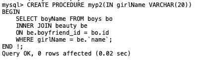

# TCL 事务控制语言 transaction control language
* 什么是事务
一个或者一组sql语句组成一个执行单元，这个执行单元要么全部执行，要不全部不执行
    * 举例子： 张三丰有1000块钱，郭襄有1000块钱，当张三丰给郭襄转账500的时候应该是会有一些sql要执行。
        1. 先扣掉张三丰500块钱: update 表 set 金额=500 where name=张三丰
        2. 郭襄的钱增加500块钱： update 表 set 金额=1500 where name=郭襄 
    但是。可能在执行完`1`的时候，数据库就挂了，不执行`2`了，这个时候数据库就会出现数据不可靠的情况，理想的处理是，两个sql都执行完，其中有一个没有执行完，就回退到上一次的状态，确保数据的可靠，事务就是用来处理这些问题的

* 事务的属性

|属性|解析|
|---|----|
| 原子性(Atomicity)|原子性是指事务包含的所有操作要么全部成功，要么全部失败回滚，因此事务的操作如果成功就必须要完全应用到数据库，如果操作失败则不能对数据库有任何影响。|
|一致性（Consistent）|一致性是指事务必须使数据库从一个一致性状态变换到另一个一致性状态，也就是说一个事务执行之前和执行之后都必须处于一致性状态。举例来说，假设用户A和用户B两者的钱加起来一共是1000，那么不管A和B之间如何转账、转几次账，事务结束后两个用户的钱相加起来应该还得是1000，这就是事务的一致性。|
|隔离性(Isolation)|隔离性是当多个用户并发访问数据库时，比如同时操作同一张表时，数据库为每一个用户开启的事务，不能被其他事务的操作所干扰，多个并发事务之间要相互隔离。关于事务的隔离性数据库提供了多种隔离级别，稍后会介绍到。|
|持久性(Durability)|持久性是指一个事务一旦被提交了，那么对数据库中的数据的改变就是永久性的，即便是在数据库系统遇到故障的情况下也不会丢失提交事务的操作。例如我们在使用JDBC操作数据库时，在提交事务方法后，提示用户事务操作完成，当我们程序执行完成直到看到提示后，就可以认定事务已经正确提交，即使这时候数据库出现了问题，也必须要将我们的事务完全执行完成。否则的话就会造成我们虽然看到提示事务处理完毕，但是数据库因为故障而没有执行事务的重大错误。这是不允许的。|


* 事务的创建
    * 隐式事务：事务没有明显开启和结束的标志，如insert, update,delete语句
        * ``` delete from 表 where id = 1 ```
    * 显式事务：事务具有明显的开启和结束标志
        * 必须设置自动提交功能为禁用 `set autocommit=0`

* 显式事务开始方式
```sql
set autocommit=0; # 必须执行
start transaction; # 可选不执行
update tab set amount=500 where name='张三丰'; # sql 1
update tab set amount=1500 where name='郭襄'; # sql 2
commit; # 或者是 rollback
```

* 列子

```sql 
CREATE TABLE IF NOT EXISTS tab(
		name VARCHAR(20) PRIMARY KEY,
		amount INT UNSIGNED
);

INSERT INTO tab VALUES('张三丰', 1000), ('郭襄', 1000);

SELECT * FROM tab;


SET autocommit=0;
START TRANSACTION;
UPDATE tab SET amount= ( (SELECT TT.cash FROM ( SELECT T.amount AS cash FROM tab T WHERE name='张三丰' ) TT ) - 500) WHERE name='张三丰';
UPDATE tab SET amount= ( (SELECT TT.cash FROM ( SELECT T.amount AS cash FROM tab T WHERE name='郭襄' ) TT ) + 500) WHERE name='郭襄';
COMMIT;
```

* 事务出现的问题
对于同时运行的多个事务，当这些事务访问数据库中**相同的数据**时,如果不采取必要的隔离机制，会出现各种并发问题
    * 脏读： 对于两个事务T1,T2，T1 读取了已经被T2更新且还没有被提交的字段之后，若T2回滚，T1读取的内容就是临时且无效的
    * 不可能重复读：对于两个事务T1,T2，T1读取了一个字段，然后T2**更新**了该字段之后，T1再次读取相同一个字段，值就不同了
    * 幻读： 对于两个事务T1,T2。T1从一个表中读取了一个字段，然后T2在该表中**插入**了一些新的行，之后，如果T1再读取同一个表，就会多出几行 


> 事务隔离级别：

| level |脏读|不可重复读|幻读|
|---|:---:|:---:|:---:|
|read uncommitted|Y|Y|Y|
|read committed|N|Y|Y|
|repeat read|N|N|Y|
|serializable|N|N|N|

* 查看当前事务隔离级别
mysql 5
```sql
select @@tx_isolation;
```

mysql 8

```sql
show variables like '%transaction_isolation%';
```

* 修改数据隔离级别

```sql
set session transaction isolation level read committed;
```

> 视图 view
本事是一个虚拟表，在真实表查询出来的。保存了sql的逻辑

* 创建视图

```sql
CREATE VIEW v_name_salary
AS
SELECT last_name, salary from employees;
```

1. 相当于把查询的结果赋值给一个变量(视图),可以在往后复用，
2. 对数据保护起来，对可以公共查看到放到视图里面


* 使用视图

    * 查看视图的内容

```sql
SELECT * FROM v_name_salary ;
```


* 加条件筛选，排序

```sql
SELECT salary FROM v_name_salary WHERE salary > 5000 ORDER BY salary;
```


> 修改视图

```sql
CREATE OR REPLACE view v_name_salary
AS
SELECT last_name, salary FROM employees WHERE salary = 6200;
```
ps: 也可以用上面的方式创建视图


查看修改之后的视图


> 删除视图

可以同时删除多个

```sql
DROP VIEW v_name_salary;
```

> 更新视图
对视图更新之后，原表也回被更新到
* 插入 (insert)

```sql
insert into v_name_salary VALUES ('qqh', 300000);
```


* 更新 (update)

```sql
UPDATE v_name_salary SET last_name = '覃淇韩' WHERE last_name = 'qqh';
```


* 删除

```sql
DELETE FROM v_name_salary WHERE last_name = '覃淇韩';
```


## 变量

* 系统变量
    * 全局变量 global
    * 回话变量  session
* 自定义变量
    * 用户变量
    * 局部变量

> 系统变量
变量由系统提供的，不是用户定义，属于服务器层面

note: 如果是全局级别的，则需要加global,如果是会话级别，则需要加session，不写默认是session的

使用的方法：
1. 查看系统所有变量
```sql
show global | session variables;
```


2. 查看满足条件的部分系统变量
```sql
show global | \[session\] variabels like '%name%'
```
3. 查看指定的某个系统变量的值
```sql
select @@global | [session].系统变量名
```

```sql
SELECT @@transaction_isolation;
```


4. 为某个系统变量赋值
    * 方式一：
```sql
set global | [session] 系统变量名 = 值;
```

```sql
set autocommit=0
```

   * 方式二

```sql
set global | [session].系统变量名=值
```

> 自定义变量
作用域：针对当前会话(连接)有效，同于会话变量的作用域

赋值的操作符： =或:=
1. 声明并初始化
    * SET @用户变量名 = 值
    * SET @用户变量名 := 值
    * select @用户变量名 := 值
2. 赋值操作
    * 方式一
        * SET @用户变量名 = 值
        * SET @用户变量名 := 值
        * select @用户变量名 := 值
    * 方式二
        * 通过select into
            * select 字段名 into @变量名 from 表格


```sql
set @name='覃淇韩'; # 声明
```


```sql
select @name;
```


```sql
set @name='qqh'; # 修改值
```


```sql
select @name; # 查看修改的值
```


* 通过查询语句给变量赋值

```sql
SELECT count(*) INTO @number FROM employees;
```


```sql
SELECT @number;
```


> 局部变量

作用域： 仅在定义的begin end 中有效

1. 声明
    * declare 变量名 类型 值
    * declare 变量名 类型 defaultVal 值
2. 赋值
    * SET 变量名 = 值
    * SET 变量名 := 值
    * select @变量名 := 值
    * 通过select into
        * select 字段名 into 变量名 from 表格


## 存储过程和函数

* 存储过程
    * 好处：
        1. 提高代码的重用性
        2. 简化操作
* 存储过程
    * 含义: 一组预先编译好的SQL语句集合，理解成批处理语句
        1. 提高代码的重用性
        2. 简化操作
        3. 减少了编译次数并且减少了和数据库服务器的连接次数，提高效率

> 创建语法

```sql
create procedure 存储过程名 (参数列表)
begin
    # 存储过程体 (一组合法的SQL语句)
end
```

注意
1. 参数列表包含三部分
    * 参数模式 参数名 参数类型
    * 举例: IN studentName varchar(20)
    * 参数模式:
        * IN: 该参数作为输入，也就是改参数需要调用方传入值
        * OUT：该参数做为输出值，也就是该参数可以做返回值
        * INOUT: 该参数作为输入也可以作为输出， 也就是该参数需要传入值，也可以返回值

2. 如果存储过程体仅仅只有一句话。 `begin end` 可以省略
3. 存储过程中的每条SQL 语句的结束要求必须加分号。
4. 存储过程的结尾可以使用 DELIMITER 重新设置
语法： 
DELIMITER 结束符号

> 调用

```sql
CALL 存储过程名(参数列表);
```

> 空参列表


1. 插入五条数据

```SQL
DELIMITER ! # 声明 重新设置 符号
CREATE PROCEDURE myp1()
BEGIN
	INSERT INTO admin(username,`password`) VALUES('qqh1', '1'),
	('qqh2', '2'),('qqh3', '3'),('qqh4', '4'),('qqh5', '5');
END !;
```

上面的语句需要在终端terminal运行一下, 结果如下；


在navicat里查对应的数据库.会看到有对应的函数名生成


调用自定义函数

```sql
CALL myp1();
```


查看通过存储过程插入的数据

```sql
SELECT * FROM admin;
```


* 根据女神名查询对应的男神名

```sql
CREATE PROCEDURE myp2(IN girlName VARCHAR(20))
BEGIN
	SELECT boyName FROM boys bo
	INNER JOIN beauty be
	ON be.boyfriend_id = bo.id
	WHERE girlName = be.`name`;
END !;
```




执行

```sql
CALL myp2('热巴');
```


```sql
CREATE PROCEDURE p_verify_user_name_and_password1(IN userName VARCHAR(20), IN password VARCHAR(20))
BEGIN
	DECLARE result INT;
	SELECT COUNT(*) INTO result FROM admin a
	WHERE userName = a.username AND `password`=a.`password`;
	SELECT if(result > 0, 'verify successful!', 'access denied') verifyResult;
END; # 这里没使用定义的 重新设置符号
```

在终端terminal执行


调用存储过程函数

```sql
CALL p_verify_user_name_and_password1('john', '8888');
```


```sql
CALL p_verify_user_name_and_password1('john', '8');
```


> OUT的模式参数类型

* 根据女神名返回对应的男神名
```sql
CREATE PROCEDURE p_by_beautyName_get_boName (IN BeautyName VARCHAR(20), OUT BoyName VARCHAR(20))
BEGIN
	SELECT bo.boyName INTO BoyName
	FROM boys bo
	INNER JOIN beauty be
	ON bo.id = be.boyfriend_id
	WHERE BeautyName = be.`name`;
END;
```
编译注册存储过程函数


```sql
SET @bName1 = '';
CALL p_by_beautyName_get_boName('赵敏', @bName1);
```


查看放回值

```sql
SELECT @bName1;
```


> INOUT的模式参数类型

* 传入a和b两个值，最终a和b都翻倍并返回

```sql
CREATE PROCEDURE doubleIncrement(INOUT A INT, INOUT B INT)
BEGIN
	SELECT A * 2, B * 2 INTO A, B;
END;

SET @a = 2;
SET @b = 3;
CALL doubleIncrement(@a, @b);
select @a, @b;
```

编译注册存储过程函数


声明变量，调用存储过程函数


查看返回值


> 查看存储过程

```sql
SHOW CREATE PROCEDURE doubleIncrement;
```


> 删除存储过程

```sql
DROP PROCEDURE doubleIncrement;
```

### 函数

* 好处：
    1. 提高代码的重用性
    2. 简化操作
* 含义: 一组预先编译好的SQL语句集合，理解成批处理语句
    1. 提高代码的重用性
    2. 简化操作
    3. 减少了编译次数并且减少了和数据库服务器的连接次数，提高效率

* 区别：
    * 存储过程：可以有0个返回，也可以有多个返回，合适批量插入，批量更新
    * 函数： 有且仅有1一个返回。适合做处理数据后返回一个结果


* 语法
```sql
CREATE FUNCTION 函数名(参数列表) RETURNS 返回类型
BEGIN
	函数体
END;
```

* 注意
    1. 参数列表分成两部分: 参数名 参数类型

    2. 函数体：肯定会有return语句，如果没有会报错
        * 如果return语句没有放在函数体的最后也不报错，但不建议
    3. return值:
        * 函数体中仅有一句话，则可以省略begin end
        * 使用 delimiter 语句结束标记


如果创建不成功，出现下面的语句
you *might* want to use the less safe log_bin_trust_function_creators variable)
可以尝试以下方法关闭掉检查
```sql
SET GLOBAL log_bin_trust_function_creators = 1;
```


```sql
CREATE FUNCTION employeeCount() RETURNS INT
BEGIN
	DECLARE c INT DEFAULT 0;
	SELECT COUNT(*) INTO c FROM employees;
	RETURN c;
END ;


```
编译注册函数


执行函数

```sql
SELECT employeeCount();
```

* 根据员工名返回工资

```sql
CREATE FUNCTION by_lastNamge_get_salary(l_name VARCHAR(20)) RETURNS DOUBLE
BEGIN
	DECLARE s DOUBLE;
	SELECT salary INTO s FROM employees WHERE last_name = l_name;
	RETURN s;
END;

SELECT by_lastNamge_get_salary('Kaufling');
```


* 根据部门id，返回该部门的平均工资

```sql
CREATE FUNCTION by_deparimentId_get_avgSalary (departmentId VARCHAR(20)) RETURNS DOUBLE
BEGIN
	SET @avgSalary = 0;
	SELECT avg(salary) INTO @avgSalary FROM employees
	WHERE department_id = departmentId
	GROUP BY departmentId;
	RETURN @avgSalary;
END;
```

编译执行之后，调用函数进行查询

```sql
SELECT by_deparimentId_get_avgSalary(90);
```


```sql
SELECT by_deparimentId_get_avgSalary(100);
```


> 查看函数

sql 查看

```sql
show create function by_deparimentId_get_avgSalary;
```


在可视化工具里面查看


点击查看对应的sql函数。我这里选择查看了 __by_deparimentId_get_avgSalary__ 函数, 查看函数的完整的定义


> 删除函数

```sql
drop create function by_deparimentId_get_avgSalary;
```

创建存储过程, 根据传入的成绩，来显示等级，比如传入的成绩：
* 90-100 A
* 80-90 B
* 60-80 C
* 其他是 D

```sql
CREATE FUNCTION getScoreGrade(score DOUBLE) RETURNS CHAR
BEGIN
	CASE
		WHEN score >= 90 or score <= 100 THEN RETURN 'A';
		WHEN score >= 80 or score < 90 THEN RETURN 'B';
		WHEN score >= 60 OR score < 80 THEN RETURN 'C';
		ELSE RETURN 'D';
	END CASE;
END;

SELECT getScoreGrade(91);
```


> ## 循环 while loop repeat
循环控制:
* iterate 类似于 continue, 继续结束当前循环，继续一下一次
* leave 类似于break， 跳出，结束当前所在的循环

1. while
语法：
```sql
    [tag:] while 循环条件 do
        循环体
    end while [tag];
```

联想js:

```js
while(condition) {
    // do anything
}
```

2. loop
实现死循环，需要用 leave 关键字跳出循环
语法

```sql
    [tag:] loop
        循环体
    end loop [tag];
```


3. repeat


语法

```sql 
    [tag:] repeat
        循环体
    until 结束循环的条件
    end repeat [tag];
```


* 插入n条数据到admin表格

```sql
CREATE PROCEDURE muiltInsert(IN c INT)
BEGIN
	DECLARE n INT DEFAULT 0;
	WHILE n < c DO
		INSERT INTO admin(username, `password`) VALUES('qqh', n);
		SET n = n + 1;
	END WHILE;

END;
```

* 插入n条数据到admin表格，当个数大于20的时候，停止插入

```SQL
CREATE PROCEDURE muiltInsert(IN c INT)
BEGIN
	DECLARE i INT DEFAULT 0;
	label: LOOP
		INSERT INTO admin(username, `password`) VALUES('qqh', i);
   	SET i = i + 1;
	IF i > 20 THEN
		LEAVE label; 
	END IF; 
END LOOP label;

END;

CALL muiltInsert(25);
```

* 插入n条数据到admin表格，当个数大于20的时候，停止插入

模拟js的 **continue** 的方式

```sql
CREATE PROCEDURE insetByMod(IN c INT)
BEGIN
	DECLARE i INT DEFAULT 0;
	label: REPEAT
		IF MOD(i,2) = 0 THEN ITERATE label; 
		END IF;
INSERT INTO admin(username, `password`) VALUES('qqh', c);
SET i = i + 1;
UNTIL i >= c END REPEAT label;
END; 
```


