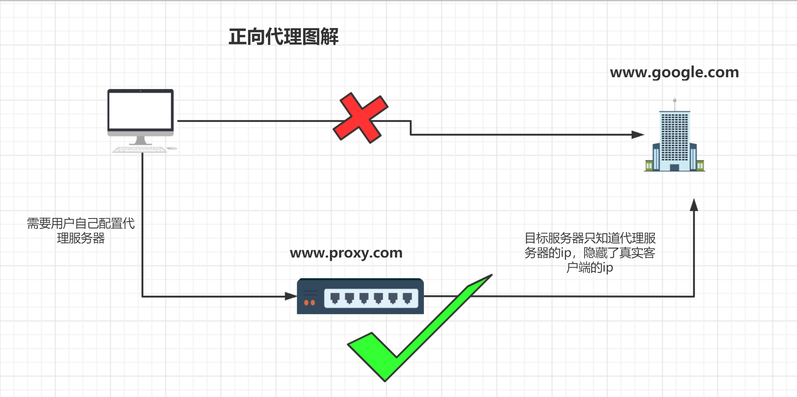
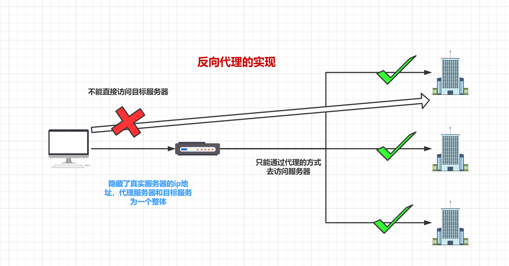
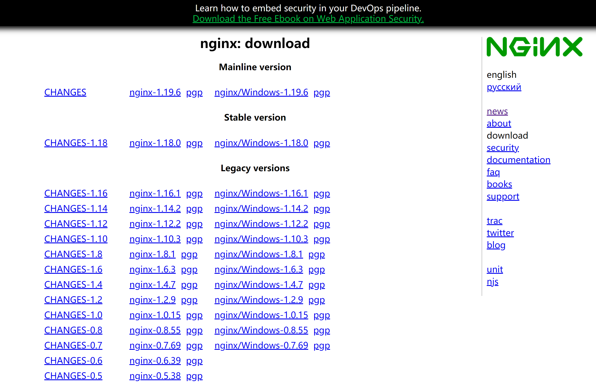
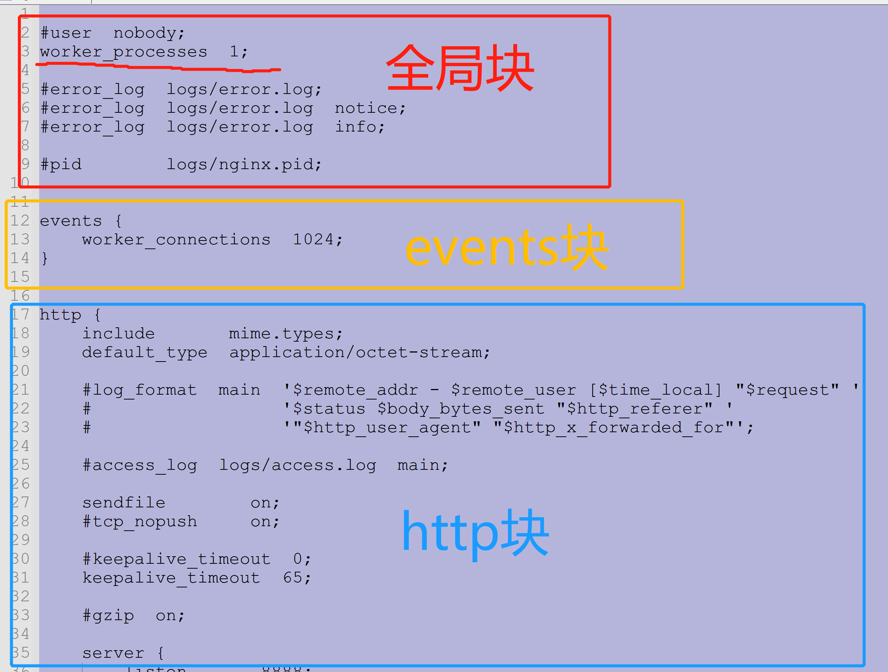
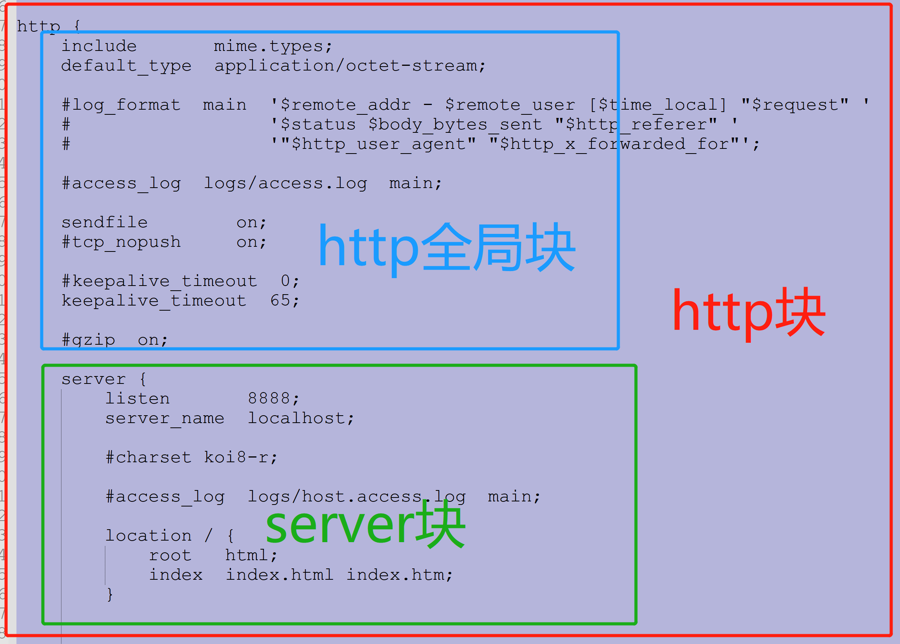
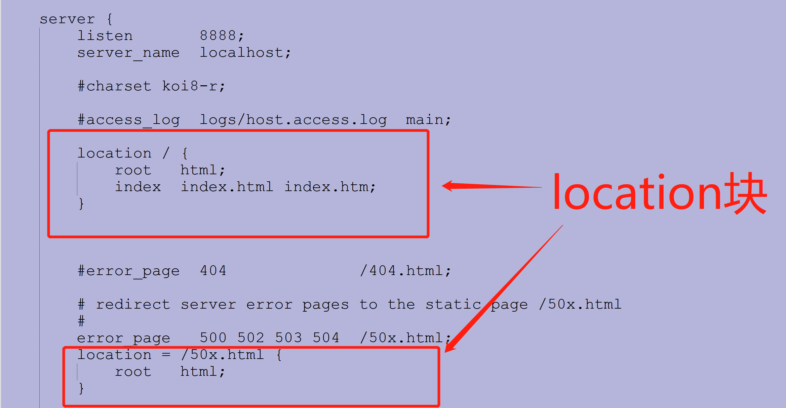
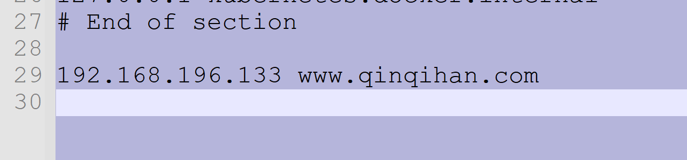
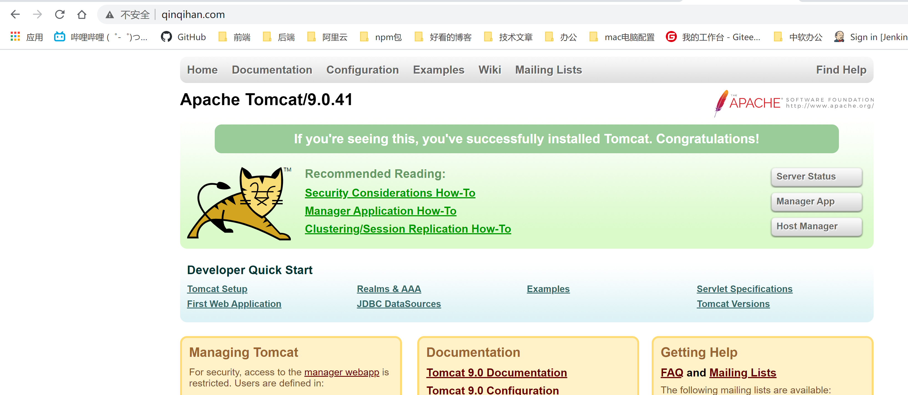
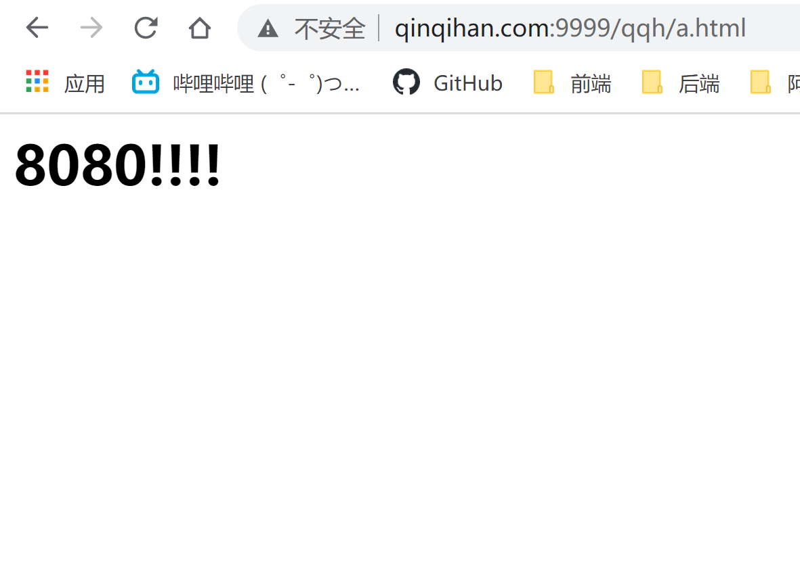

# nginx

## 正向代理



## 反向代理



## centos7安装nginx

1. gcc 安装
安装 nginx 需要先将官网下载的源码进行编译，编译依赖 gcc 环境，如果没有 gcc 环境，则需要安装：

```bash
yum install gcc-c++
```

2. PCRE pcre-devel 安装

PCRE(Perl Compatible Regular Expressions) 是一个Perl库，包括 perl 兼容的正则表达式库。nginx 的 http 模块使用 pcre 来解析正则表达式，所以需要在 linux 上安装 pcre 库，pcre-devel 是使用 pcre 开发的一个二次开发库。nginx也需要此库。命令：

```bash
yum install -y pcre pcre-devel
```

3. zlib 安装

zlib 库提供了很多种压缩和解压缩的方式， nginx 使用 zlib 对 http 包的内容进行 gzip ，所以需要在 Centos 上安装 zlib 库。

```bash
yum install -y zlib zlib-devel
```

4. OpenSSL 安装
OpenSSL 是一个强大的安全套接字层密码库，囊括主要的密码算法、常用的密钥和证书封装管理功能及 SSL 协议，并提供丰富的应用程序供测试或其它目的使用。
nginx 不仅支持 http 协议，还支持 https（即在ssl协议上传输http），所以需要在 Centos 安装 OpenSSL 库。

```bash
yum install -y openssl openssl-devel
```

5. 下载nginx
* 使用wget命令下载（推荐）。确保系统已经安装了wget，如果没有安装，执行 yum install wget 安装。

需要下载的版本号，可以通过官网查询，修改成对应的版本号，就可以下载对应的版本号
```bash
wget -c https://nginx.org/download/nginx-1.12.0.tar.gz
```

点击下载对应的版本，通过FTP上传到对应的目录下



6. 解压nginx包

```bash
tar -zxvf nginx-1.12.0.tar.gz
cd nginx-1.12.0
```

7. 配置

```
./configure
```

8. 编译和安装

```
make && make install
```


9. 开机启动nginx

在rc.local增加启动代码

```bash
vi /etc/rc.local
```
增加一行 /usr/local/nginx/sbin/nginx

修改执行权限

```
chmod 755 rc.local
```

## 开启防火墙。

让外部电脑可以访问

* 开启端口号80

```bash
[root@192 sbin]# firewall-cmd --permanent --zone=public --add-port=80/tcp --permanent
```

* 测试端口号有没有开启成功

```bash
[root@192 sbin]# firewall-cmd --permanent  --query-port=80/tcp --permanent
```


* 重启防火墙

```
firewall-cmd --reload
```


## 常用命令
启动,停止，重启nginx

查找安装完之后的nginx在那个目录
```
[root@192 /]# whereis nginx
nginx: /usr/local/nginx
```

* 启动nginx
```
[root@192 sbin]# ./nginx
[root@192 sbin]# ps -ef|grep nginx
root      88173      1  0 19:41 ?        00:00:00 nginx: master process ./nginx
nobody    88174  88173  0 19:41 ?        00:00:00 nginx: worker process
root      89924   9372  0 19:43 pts/0    00:00:00 grep --color=auto nginx
[root@192 sbin]# cd  /usr/local/nginx/sbin
```
启动nginx是在/usr/local/nginx/sbin目录下的nginx可执行程序

* 停止nginx
```
[root@192 sbin]# ./nginx -s stop
```

* 退出nginx
```
[root@192 sbin]# ./nginx -s quit
```

* 重启nginx
```
[root@192 sbin]# ./nginx -s reload
```

## nginx配置文件


* 所在目录
nginx安装目下`/usr/local/nginx/conf`



### 全局快
* 配置影响nginx全局的指令。
* 一般有运行nginx服务器的用户组
* nginx进程pid存放路径
* 日志存放路径，配置文件引入
* 允许生成worker process数等。

### events块
* 配置影响nginx服务器或与用户的网络连接。
* 有每个进程的最大连接数，选取哪种事件驱动模型处理连接请求，是否允许同时接受多个网路连接，开启多个网络连接序列化等。

### http块
* 可以嵌套多个server，配置代理，缓存，日志定义等绝大多数功能和第三方模块的配置。

* 如文件引入，mime-type定义，日志自定义，是否使用sendfile传输文件，连接超时时间，单连接请求数等。


##### http server块
* 配置虚拟主机的相关参数，一个http中可以有多个server。


#### location 块
* 配置请求的路由，以及各种页面的处理情况。



## nginx配置实例 - 反向代理

1. 实现效果
打开浏览器，在浏览器地址栏输入地址，www.qinqihan.com 跳转到tomcat首页

2. 准备工作
> 配置hosts文件

配置window系统下的hosts文件
* 路径：`C:\Windows\System32\drivers\etc`
* 配置上一下信息


> 虚拟机下载tomcat

```bash
docker pull tomcat
docker run -d -p 8080:8080 --name mytomcat tomcat
```

3. 配置nginx.conf配置文件

```bash
worker_processes  1;

events {
    worker_connections  1024;
}

http {
    include       mime.types;
    default_type  application/octet-stream;
    sendfile        on;
    keepalive_timeout  65;

    server {
        listen       80; # 端口号
        server_name  192.168.196.133; # nginx 访问的ip

        location / { # 当访问的路径为规则 / 
            root   html;
            proxy_pass http://127.0.0.1:8080; # 代理到该地址，该地址是映射在docker上的tomcat地址
            index  index.html index.htm;
        }
    }
}
```

4. 重新加载nginx
去到nginx所在目录，`/usr/local/nginx/sbin`
```
./nginx -s reload
```

5. 测试



---
### 根据url的路径转发到不同的端口号
> 需求
* 访问`www.qinqihan.com:999/qqh/a.html`是去到`8080`端口号的tomcat
* 访问`www.qinqihan.com:999/cql/a.html`是去到`8081`端口号的tomcat

> 准备工作

1. 启动两个tomcat的docker容器

```bash
docker run -d -p 8080:8080 -v /tomcatDate:/data1 --name tomcat8080 tomcat
docker run -d -p 8081:8080 -v /tomcatDate:/data1 --name tomcat8081 tomcat
```

2. 在真实机上创建一个html文件

```
cd /tomcatDate
touch a.html
vim a.html
```

3. 将以下的html代码复制进`a.html`文件里面

```html
<h1>8080!!!</h1>
```

4. 进入8080端口号的tomcat docker,配置一下文件

```bash
docker exec -it tomcat8080 /bin/bash
# 现在这个版本的docker tomcat删除默认的webapps文件。重命名webapps.dist文件
rm -rf webapps
mv webapps.dist/ ./webapps
cd webapps
mkdir qqh
cd qqh
cp /tomcatDate/a.html /usr/local/tomcat/webapps/qqh/
```
`ctrl` + `p` + `q` 后台运行容器

修改`a.html`文件

```
vim /tomcatDate/a.html
```

将以下的**a.html**的代码修改成以下

```html
<h1>8081!!!</h1>
```


5. 进入8081端口号的tomcat docker,配置一下文件

```bash
docker exec -it tomcat8080 /bin/bash
# 现在这个版本的docker tomcat删除默认的webapps文件。重命名webapps.dist文件
rm -rf webapps
mv webapps.dist/ ./webapps
cd webapps
mkdir cql
cd cql
cp /tomcatDate/a.html /usr/local/tomcat/webapps/caql/
```
`ctrl` + `p` + `q` 后台运行容器

6. 修改nginx配置

```bash
worker_processes  1;

events {
    worker_connections  1024;
}

http {
    include       mime.types;
    default_type  application/octet-stream;
    sendfile        on;

    server { # 当前端口号也可以访问到nginx
        listen       80;
        server_name  192.168.196.133;
        location / {
            root   html;
            proxy_pass http://127.0.0.1:8080;
            index  index.html index.htm;
        }
    }
    
    server { # 当前端口号也可以访问到nginx
        listen       9999;
        server_name  192.168.196.133; # 你当前nginx所在的服务器IP

        location ~ /qqh/ { # 路径包含/qqh/(区分大小写)，跳转到下面端口号
            root   html;
			proxy_pass http://127.0.0.1:8080;
            index  index.html index.htm;
        }
		location ~ /cql/ { # 路径包含/cql/(区分大小写)，跳转到下面端口号
            root   html;
			proxy_pass http://127.0.0.1:8081;
            index  index.html index.htm;
        }
    }
}
```

7. 重新加载nginx的配置文件

```bash
cd /usr/local/nginx/sbin/
./nginx -s reload
```

8. 测试效果

* 访问`www.qinqihan.com:999/qqh/a.html`



* 访问`www.qinqihan.com:999/cql/a.html`


## 负载均衡策略

__需求__

> 轮询(默认)策略

访问**http://www.qinqihan.com/qqh/a.html**，`平均分配`请求到不同的tomcat的服务器，

准备工作：
* 准备两台tomcat的服务器
* 防火墙开启对应的端口号
* 配置如下文件`/usr/local/nginx/conf/nginx.conf`
```bash
worker_processes  1;

events {
    worker_connections  1024;
}

http {
    include       mime.types;
    default_type  application/octet-stream;
    sendfile        on;
    keepalive_timeout  65;
    upstream myserver { # 定义轮询的目标服务器
        server 192.168.196.133:8080;
	    server 192.168.196.133:8081;
    }

    server {
        listen       80;
        server_name  192.168.196.133;
        location ~ /qqh/ {
	        proxy_pass http://myserver; # 使用定义的服务器
        }
    }
}
```
* 重启nginx服务

> 权重(weight)策略

* 权重大的优先分配
* 如有15个请求，有大概率的5个请求是去到8080，有大概率的10个请求是去到8081的

具体配置如下

```bash
worker_processes  1;
events {
    worker_connections  1024;
}
http {
    include       mime.types;
    default_type  application/octet-stream;

    sendfile        on;
    keepalive_timeout  65;

    upstream myserver { # 定义轮询的目标服务器
        server 192.168.196.133:8080 weight = 5;
	    server 192.168.196.133:8081 weight = 10;
    }

    server {
        listen       80;
        server_name  192.168.196.133;

        location ~ /qqh/ {
	        proxy_pass http://myserver; # 使用定义的服务器
        }
    }
}
```

> ip hash

* 当客户第一次访问，被分配到的服务器ip，下次访问，就一直是这个ip

配置如下：

```bash
worker_processes  1;
events {
    worker_connections  1024;
}
http {
    include       mime.types;
    default_type  application/octet-stream;

    sendfile        on;
    keepalive_timeout  65;

    upstream myserver {
        ip_hash; # 启用ip hash的模式，给客户端分配服务器
        server 192.168.196.133:8080;
	    server 192.168.196.133:8081;
    }

    server {
        listen       80;
        server_name  192.168.196.133;

        location ~ /qqh/ {
	        proxy_pass http://myserver;
        }
    }
}
```

> fair策略 (三方) 

* 给客户端分配响应时间短的服务器

配置如下：

```bash
worker_processes  1;
events {
    worker_connections  1024;
}
http {
    include       mime.types;
    default_type  application/octet-stream;

    sendfile        on;
    keepalive_timeout  65;

    upstream myserver {
        fair; # 启用fair模式，给客户端分配服务器
        server 192.168.196.133:8080;
	    server 192.168.196.133:8081;
    }

    server {
        listen       80;
        server_name  192.168.196.133;

        location ~ /qqh/ {
	        proxy_pass http://myserver;
        }
    }
}
```
