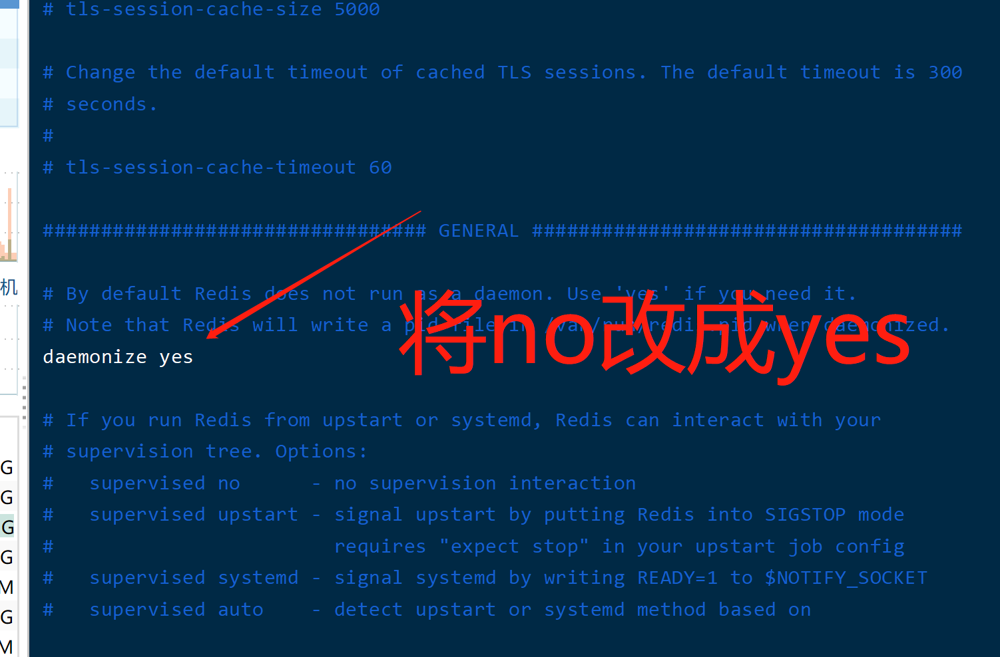

# redis 学习笔记
## 安装
点击[下载](https://download.redis.io/releases/redis-6.0.9.tar.gz)redis-6.0.9

> 上传到服务器
```bash
# 解压
tar -xvf redis-6.0.9.tar.gz
# 重命名redis
mv redis-6.0.9.tar.gz ./redis
# 删除旧的包
rm -rf redis-6.0.9.tar.gz
# 进入
cd redis
# 编译，会生成一个src目录
make
# 复制一份配置文件redis.conf
cp redis.conf ./redis.conf.init
# 修改配置文件，让redis后台启动
vim redis.conf
```


```bash
# 在redis目录下，将配置文件，复制到src目录下
cp redis.conf src/
# 进入src目录下
cd src/
# 启动redis-server
./redis-server
# 启动redis-cli
./redis-cli
```
> 进入到redis数据界面，测试数据是否正常
```bash
127.0.0.1:6379> ping
PONG
127.0.0.1:6379> 
```
redis数据库安装成功，撒花

## 对key的操作
> del

删除key,
```sql
127.0.0.1:6379> set name qqh
OK
127.0.0.1:6379> get name 
"qqh"
127.0.0.1:6379> del name
(integer) 1
127.0.0.1:6379> 
```
> exists

查看key是否存在
```sql
127.0.0.1:6379> exists name
(integer) 1
127.0.0.1:6379> exists name1
(integer) 0
127.0.0.1:6379> 
```
> expire

给key添加过期时间，以秒s为单位，过期后不可用
```sql
# 给name添加过期时间，为10s
127.0.0.1:6379> expire name 10
(integer) 1
127.0.0.1:6379> ttl name # 检查name字段还剩多少时间过期
(integer) 3 # 还剩3s
127.0.0.1:6379> ttl name
(integer) -2 # 已过期
127.0.0.1:6379> get name
(nil) # 已经无法再拿到key
```

> pexpire

给字段设置过期时间，以毫秒为单位
```sql
127.0.0.1:6379> set k1 v1
OK
127.0.0.1:6379> pexpire k1 20000
(integer) 1
127.0.0.1:6379> ttl k1
(integer) 16
127.0.0.1:6379> ttl k1
(integer) -2
127.0.0.1:6379> exists k1
(integer) 0
127.0.0.1:6379> 
```

> keys

查找给定格式的key

```sql
# 查找所有key
127.0.0.1:6379> mset k1 v1 k2 v2 k3 v3
OK
127.0.0.1:6379> keys *
1) "k3"
2) "k2"
3) "k1"
```

> pttl

以毫秒的形式返回key剩余的过期时间

```sql
127.0.0.1:6379> set k1 b1
OK
127.0.0.1:6379> pexpire k1 10000
(integer) 1
127.0.0.1:6379> pttl k1
(integer) 5101
127.0.0.1:6379> pttl k1
(integer) -2
127.0.0.1:6379> exists k1
(integer) 0
127.0.0.1:6379> 
```

> ttl

以秒为单位，返回key剩余的过期时间
```sql
127.0.0.1:6379> set k3 v3
OK
127.0.0.1:6379> expire k3 10
(integer) 1
127.0.0.1:6379> ttl k3
(integer) 6
127.0.0.1:6379> 
```

> move

将key移动到其他数据，被移走后，当前数据库不存在被移走的key

```sql
127.0.0.1:6379> set key1 value1
OK
127.0.0.1:6379> select 1 
OK
127.0.0.1:6379[1]> exists key1
(integer) 0
127.0.0.1:6379[1]> select 0
OK
127.0.0.1:6379> move key1 1
(integer) 1
127.0.0.1:6379> get key1
(nil)
127.0.0.1:6379> select 1
OK
127.0.0.1:6379[1]> exists key1
(integer) 1
127.0.0.1:6379[1]> 
```

> randomkey

从数据库中随机返回一个key

```sql
127.0.0.1:6379> mset k1 v1 k2 v2 k3 v3 k4 v4
OK
127.0.0.1:6379> randomkey
"k2"
127.0.0.1:6379> randomkey
"k1"
127.0.0.1:6379> randomkey
"k4"
127.0.0.1:6379> 
```

> rename

将旧key修改成新key

```sql
127.0.0.1:6379> set old hahaha
OK
127.0.0.1:6379> rename old new
OK
127.0.0.1:6379> get old
(nil)
127.0.0.1:6379> get new
"hahaha"
127.0.0.1:6379> 
```

> renamenx

当要成的新key不存在则成功，存在着不成功

```sql
127.0.0.1:6379> keys *
1) "k3"
2) "k4"
127.0.0.1:6379> renamenx k3 k2 # k2不存在
(integer) 1 # 成功
127.0.0.1:6379> keys *
1) "k4"
2) "k2"
127.0.0.1:6379> renamenx k2 k4 # k4存在
(integer) 0 # 不成功
127.0.0.1:6379> 
```

> type 检测key对应的值的类型

```sql
127.0.0.1:6379> get k1
"v1"
127.0.0.1:6379> type k1
string
```


## string 类型


