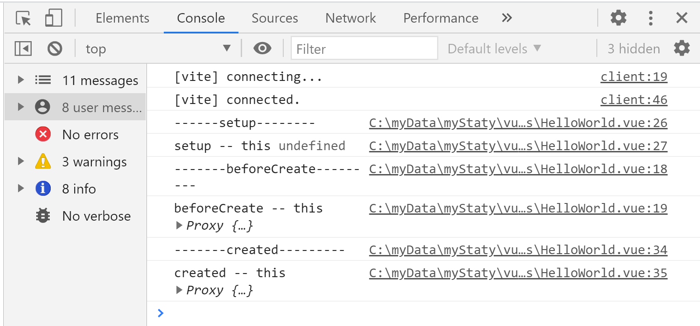

# vue是如何提升性能的

[vue3.0代码编译器](https://vue-next-template-explorer.netlify.app/)

> 添加静态标记


编译的模板
```html
<div>
  <p>你好</p>
  <p>很好</p>
  <p>{{text}}</p>
</div>
```
编译之后的模板

```js
import { createVNode as _createVNode, toDisplayString as _toDisplayString, openBlock as _openBlock, createBlock as _createBlock } from "vue"

export function render(_ctx, _cache, $props, $setup, $data, $options) {
  return (_openBlock(), _createBlock("div", null, [
    _createVNode("p", null, "你好"),
    _createVNode("p", null, "很好"),
    _createVNode("p", null, _toDisplayString(_ctx.text), 1 /* TEXT */)
  ]))
}
```
* 在2.0之前的diff算法的对比
* 有多少个节点，节点的内容，属性，函数都会一一对比


* 3.0之后，对diff算法要对比的内容发生了变化
* 只对比有静态标记的，而且是根据静态标记类型去做对比
* 第三个p标签，有一个静态标记，标记类型为1，当数据变化，生成新的虚拟dom的时候，只会比较一次，而且只比较文本是否发生变化


> 静态提升

* 在页面的右上角，开启静态提升


* 编译器生成的静态模板如下

```js
import { createVNode as _createVNode, toDisplayString as _toDisplayString, openBlock as _openBlock, createBlock as _createBlock } from "vue"

const _hoisted_1 = /*#__PURE__*/_createVNode("p", null, "你好", -1 /* HOISTED */)
const _hoisted_2 = /*#__PURE__*/_createVNode("p", null, "很好", -1 /* HOISTED */)

export function render(_ctx, _cache, $props, $setup, $data, $options) {
  return (_openBlock(), _createBlock("div", null, [
    _hoisted_1,
    _hoisted_2,
    _createVNode("p", null, _toDisplayString(_ctx.text), 1 /* TEXT */)
  ]))
}
```
* 会将之前没有双向数据绑定的模板，提升到`render`函数之后，每一次更新，都不会再创建没有标记的模板，复用变量，提升代码运行的效率


> 缓存事件侦听器

```html
<div>
  <p>你好</p>
  <p @click="onclick">很好</p>
  <p>{{text}}</p>
</div>
```
* 未开启侦听器之前
事件会被绑定成静态标记，再更新的时候，会被重新绑定新的函数
```js
import { createVNode as _createVNode, toDisplayString as _toDisplayString, openBlock as _openBlock, createBlock as _createBlock } from "vue"

export function render(_ctx, _cache, $props, $setup, $data, $options) {
  return (_openBlock(), _createBlock("div", null, [
    _createVNode("p", null, "你好"),
    _createVNode("p", { onClick: _ctx.onclick }, "很好", 8 /* PROPS */, ["onClick"]),
    _createVNode("p", null, _toDisplayString(_ctx.text), 1 /* TEXT */)
  ]))
}
```

* 开启侦听器之后

在网站上的右上角的option开启


```js
import { createVNode as _createVNode, toDisplayString as _toDisplayString, openBlock as _openBlock, createBlock as _createBlock } from "vue"

export function render(_ctx, _cache, $props, $setup, $data, $options) {
  return (_openBlock(), _createBlock("div", null, [
    _createVNode("p", null, "你好"),
    _createVNode("p", {
      onClick: _cache[1] || (_cache[1] = (...args) => (_ctx.onclick && _ctx.onclick(...args)))
    }, "很好"),
    _createVNode("p", null, _toDisplayString(_ctx.text), 1 /* TEXT */)
  ]))
}
```
* 当第一次渲染成虚拟dom的时候，`_cache[1]`是`undefined`，执行后面的表达式，将当前的函数缓存到全局的 `_cache[1]`的数组里面，第二次运行的时候，就不会再次生成新的函数，复用之前生成的函数


## 安装vue3.0

* vue/cli 安装

```bash
npm install -g vue/cli
vue create projectName
```
选择到对应的vue3.0项目

* vite 

```
npm install -g create-vite-app
create-vite-app projectName
cd projectName
npm install
npm run dev
```

## ref 函数
* ref函数，是用来创建简单数据的响应的

```html
<template>
  <div>
    <p>num: {{ num }}</p>
    <button @click="increNum">num++</button>
  </div>
</template>
```


点击num++按钮改变数据

```js
import {
  ref
} from 'vue'
export default {
  setup() {
    const num = ref(0);
    const increNum = () => {
      num.value += 1;
    };

    return {
      num,
      increNum
    };
  }
};
```

## reactive 函数
* 用对象来创建响应式数据的

```html
<template>
  <div>
    <ul>
      <li
        v-for="item in studenInfo.list"
        :key="item.id"
        @click="removeInfo(item.id)"
      >
        name: {{ item.name }} --- age: {{ item.age }}
      </li>
    </ul>
  </div>
</template>
```


```js
import {
  reactive
} from 'vue'
export default {
  setup() {
    let studenInfo = reactive({
      list: [
        {
          name: 'qqh',
          age: 18,
          id: 0
        },
        {
          name: 'hd',
          age: 20,
          id: 1
        },
        {
          name: 'el',
          age: 27,
          id: 2
        }
      ]
    })

    const removeInfo = (id) => {
      studenInfo.list = studenInfo.list.filter(item => item.id !== id);
    }
    return {
      studenInfo,
      removeInfo
    }
  }
}
```

## setup 函数

vue3.0是composition API，与2.0 options API最大的区别就是在这个setup函数，函数在`beforeCreate`生命周期函数之前执行，将setup函数返回的响应式数据和方法注入到option中，composition API 也叫做inject API

* 在beforeCreate函数之前调用
* 没有`this`,所以无法使用methods的方法，和data的里的变量




* 不能是同步的，只能是异步的函数，如下代码

```html
<template>
  <div>
    <p>msg</p>
  </div>
</template>
```

```js
export default {
  beforeCreate() {
    console.log('-------beforeCreate---------');
  },
  async setup() {
    console.log('------setup--------')
  },
  created() {
    console.log('-------created---------')
  }
};
```
* setup函数被执行了，生命周期函数没有继续往下走


## ref 和 reactive 的区别

```html
<template>
  <div>
    <p>msg-reactive: {{msgReactive}}</p>
    <p>msg-ref: {{refMsg}}</p>
  </div>
</template>
```


```js
import {
  reactive,
  ref
} from 'vue'
export default {
  setup() {
    const msgReactive = reactive({
      value: 'hello vue3.0'
    })
    console.log('msgReactive', msgReactive)
    console.log('================================================')
    const refMsg = ref('hello vue3.0')
    console.log('refMsg', refMsg)

    return {
      refMsg,
      msgReactive
    }
  }
};
```

* reactive 会被封装成proxy对象
* ref 传进去普通的值，会被封装一个对象，赋值给对象的`value`属性，然后这个对象会被`reactive`封装一次，生成了一个响应式的`proxy`
* vue会判断当前是`reactive`还是`ref`对象，在视图层渲染的时候，如果是`ref`对象，才自动添加这个`.value`的属性
* 在vue里面，会通过`__v_isRef`来判断是不是`ref`
* 判断`reactive`，是`isReactive()`方法
* 判断`ref`，是`isRef()`方法

```js
import {
  reactive,
  ref,
  isReactive,
  isRef
} from 'vue'
export default {
  setup() {
    const msgReactive = reactive({
      value: 'hello vue3.0'
    })
    const refMsg = ref('hello vue3.0')

    console.log('类型检查')
    console.log('msgReactive', isReactive(msgReactive))
    console.log('refMsg', isReactive(refMsg))
    console.log('----------------------------')
    console.log('msgReactive', isReactive(msgReactive))
    console.log('refMsg', isReactive(refMsg))

    return {
      refMsg,
      msgReactive
    }
  }
```
结果如下：


