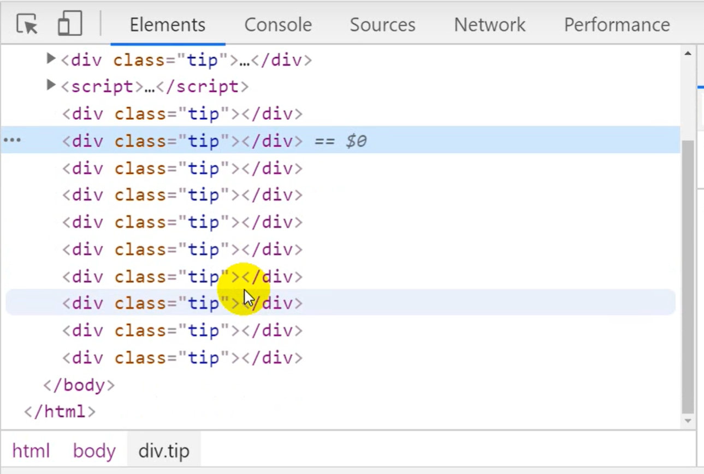

# 单列模式
### 模式解决的问题：
 * 需求: 我们做一个弹出
 * 出现的问题：每次点开一个弹窗，就会生成一份新的html结构插入到文件末尾
 
 * 解决方案: ，是把同一个div隐藏。显示的时候只需要把之前的div显示。并改变其内容。
```js
// 代码逻辑
function Alert(title) {
    this.title = title
}

const a1 = new Alert('标题1')
const a2 = new Alert('标题2')
console.log(a1 === a2) // ==> false
```
* Answer: 因为new 构造之后，生成不同的instance ，在不同的内存空间。
* 以下为核心代码的解决方案
```js
// 解决方案

function Persion(name) {
    this.name = name
}

let instance = null

const singleTon = function(name) {
    if(!instance) instance = new Persion(name) 
    return instance
}

const p1 = singleTon('xiaoxiao')
const p2 = singleTon('qqh')

console.log(p1 === p2) // output ==> true
```
思路：
1. 用一个变量去存instance
2. 执行一个函数，判断之前存的变量的是否存了东西，有则返回
问题：不用 `new` 关键字去创建实例了


## 优化单体实例
优化思路：
1. 用闭包保存install的变量
2. new 关键字调用函数
```js
const Persion = (function(){
    let instance = null
    function Persion(name) {
        this.name = name
    }

    return function(...args) {
        if(!instance) {
            instance = new Persion(...args)
        }
        return instance
    }
})()

const p1 = new Persion('xiaoxiao')
const p2 = new Persion('qqh') // 代码执行了，但没有改变单体实例的属性

console.log(p1 === p2) // output ==> true
```

